# 가스 모니터링 프로그램 (서버)

## 1. 프로젝트 개요
개발 기간: 2025-10 ~ 2025~12

이 프로그램은 작업자의 안전 확보와 및 편의성 향상을 목적으로 개발된
가스 모니터링 프로그램입니다.

현장에 설치된 센서와 유선 통신하여 다음과 같은 가스 정보를 측정하고,
측정된 값을 실시간으로 화면에 표시합니다.

- CO (일산화탄소)
- O₂ (산소)
- H₂S (황화수소)
- CO₂ (이산화탄소)
- LEL (가연성 가스, %LEL)

<table align="center">
    <tr>
        <td align="center">
            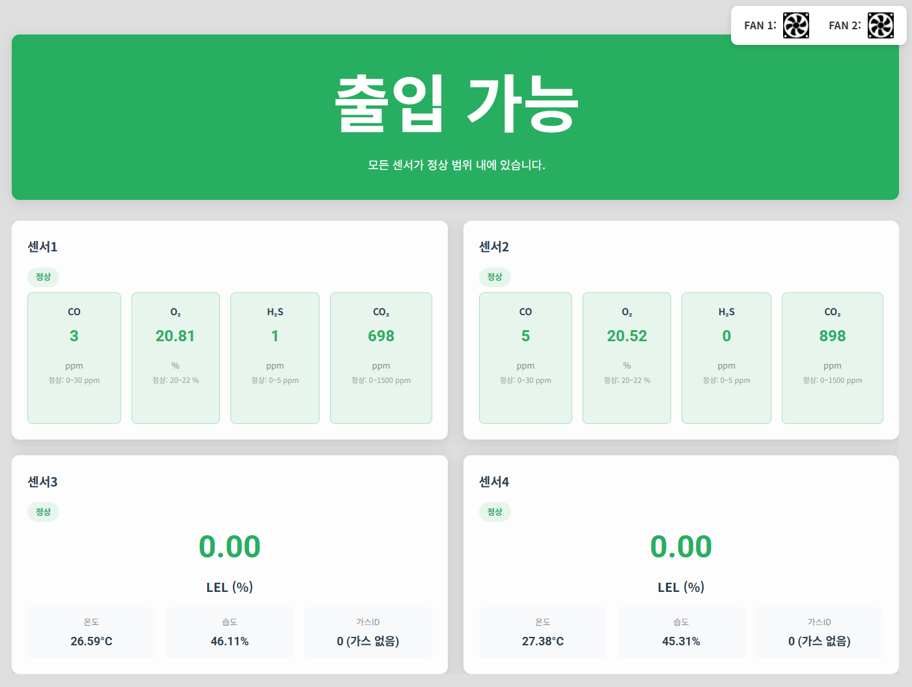
            <br>
            <b>화면 예시</b>
        </td>
    </tr>
</table>

오수처리시설 내부는 작업 전·중에 유해 가스가 발생할 가능성이 높고,
밀폐 공간 특성상 가스 농도가 급격히 상승할 경우 중대한 안전사고로 이어질 수 있습니다.

이에 따라 이 시스템은
- 작업자가 시설 내부로 진입하기 전, 현재 가스 상태를 사전에 확인하여 작업 가능
  여부를 판단할 수 있도록 하고
- 작업자가 시설 내부에 진입한 이후에도, 가스 농도를 지속적으로 모니터링하여
  위험 수치 도달 시 즉시 경보를 발생시켜 작업자가 신속히 대피할 수 있도록 지원하는
  것을 목표로 개발되었습니다.
  
또한, 작업 중 배기팬의 실제 동작 여부를 함께 확인함으로써 환기 설비의 동작이 
정상적으로 이루어지고 있는지를 직관적으로 알 수 있도록 구성하였습니다.

이 시스템은 다음과 같은 현장 요구사항을 충족하도록 설계 및 개발되었습니다.

**주요 요구사항**
1. 작업자 시설 진입 전, 현재 가스 수치를 사전에 확인
2. 작업자가 시설 내부에 있는 동안, 가스 농도를 지속적으로 모니터링
3. 가스 수치가 기준치 이상으로 상승할 경우, 즉시 경보 발생
4. 배기팬 실시간 동작 여부 확인 (무전압 접점 신호 기반)

**추가 요구사항**
1. 시설 진입 전 경보 정상 동작 여부를 확인할 수 있는 경보 테스트 기능
2. 테스트 목적의 가스 임계치 수정 기능 및 수정 이력 로그 저장
3. DB 미사용 구조 기반의 경량 시스템 구성


---

## 2. 기술스택
[](https://skillicons.dev)

### 주요 사용 기술 및 라이브러리
- jSerialComm (USB 시리얼 통신)
- Spring WebSocket (STOMP 기반 실시간 데이터 전송)

---

## 3. 아키텍처
가스 모니터링 프로그램은 `센서 데이터 수집 → 상태 판단 → 
배기팬 상태 확인 및 경보 제어`의 흐름으로 동작합니다.

> 아래 그림은 시스템 전체 구성과 각 구성 요소 간의 신호 흐름을 나타냅니다.

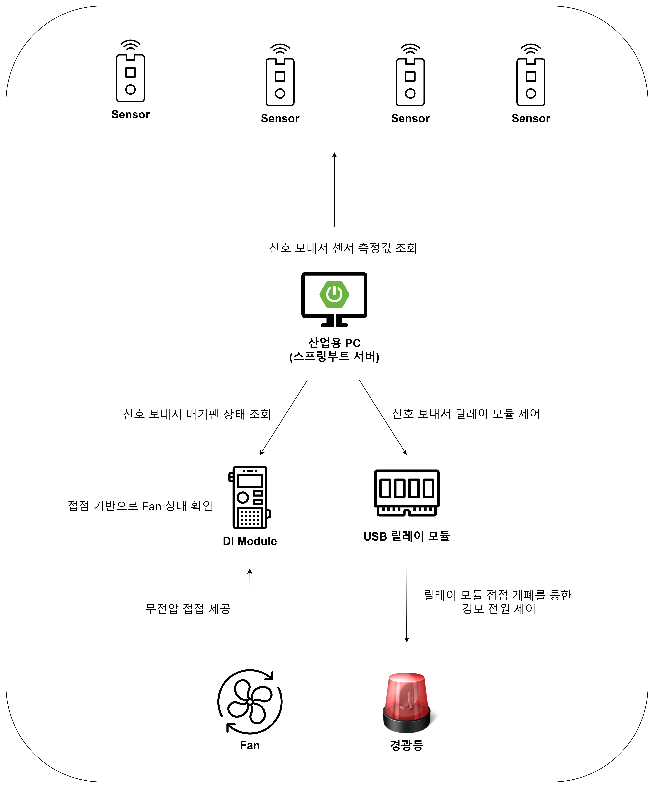

---

### 3-1) 전체 동작 흐름
1. 가스 센서 데이터 수집
   - 현장에 설치된 가스 센서는 2종류(UA58-KFG-U, UA58-LEL)로 구성되어 있으며,
     UA58-KFG-U는 CO, O₂, H₂S, CO₂ 값을 측정하고
     UA58-LEL은 가연성 가스(LEL, %LEL) 값을 측정합니다.
   - 산업용 PC에서 동작하는 Spring Boot 서버는  
     주기적으로 센서에 신호를 전송하여 각 센서의 측정 값을 조회합니다.
 
2. 센서 데이터 처리 및 표시
   - Spring Boot 서버는 수신한 센서 데이터를 기반으로 현재 가스 상태를 판단하고,  
     작업자가 실시간으로 확인할 수 있도록 화면에 표시합니다. 

3. 경보 제어 (USB 릴레이 모듈 연동)
    - 가스 수치가 기준치를 초과한 경우, 서버는 USB 릴레이 모듈에 제어 신호를
      전달하여 경광등(경보 장치)을 제어합니다.
    
4. 배기팬 상태 확인 (DI 모듈 연동)
   - Spring Boot 서버는 DI 모듈과 통신하여  
     배기팬의 실제 동작 여부를 무전압 접점(Dry Contact) 신호 기반으로 확인합니다.

---

### 3-2) 서버 동작 흐름
가스 모니터링 시스템의 백엔드는 WebSocket + STOMP 기반의 구독 모델로 동작하며,
클라이언트의 구독 상태에 따라 센서 통신과 스케줄러를 동적으로 관리합니다.

#### 1) WebSocket 연결 수립
   - 클라이언트는 서버의 웹소켓 엔드포인트로 연결을 시도합니다.

```
ws://localhost:8081/ws/sensor
```
- 이 단계에서는 단순히 소켓 연결만 수립되며, 아직 특정 센서 데이터에 대한 구독은
  이루어지지 않은 상태입니다.

---

#### 2) STOMP 구독 요청 처리
   - 클라이언트는 특정 센서의 데이터를 수신하기 위해 아래 형식의 STOMP 토픽을 구독합니다.

```
/topic/sensor/{model}/{port}/{serialNumber}
```
- 해당 구독 이벤트는 StompEventListener의 handleSessionSubscribeEvent()에서 처리됩니다. 


**구독 처리 절차는 다음과 같습니다.**
1. destination 값을 파싱하여
    - 센서 모델명
    - 시리얼 포트
    - 센서 시리얼 번호를 추출합니다.
   
2. 센서 모델이 서버에서 지원하는 타입이지 검증합니다.
    - 허용 모델: `UA58-KFG-U`, `UA58-LEL`

3. 구독 세션과 센서 식별 키를 매핑하여 내부 Map에 등록합니다
    - 센서 식별 키 형식: {model}:{port}:{serialNumber}

```
예시:
sessionSubscriptions = {
  "session1234" -> "UA58-KFG-U:COM3:25090199"
}
```

---

#### 3) 센서 데이터 수집 및 주기적 전송
  - 서버는 센서 식별 키 단위로 스케줄러를 관리하며, 동일한 센서를 구독하는 세션이 여러 개일 경우
    하나의 스케줄러만 생성하여 데이터를 수집합니다.
  - 수집된 센서 데이터는 해당 토픽을 구독 중인 모든 클라이언트에게 실시간으로 전송됩니다.

---

#### 4) 구독 해제 및 세션 종료 처리
  - 다음 상황에서 세션 종료 이벤트가 발생할 수 있습니다.
    - 클라이언트가 구독을 명시적으로 해제한 경우
    - 네트워크 문제 등으로 WebSocket 연결이 종료된 경우
  - 세션 종료 시 처리 흐름은 다음과 같습니다.
    - 세션 ID에 매핑된 센서 구독 키를 조회 후 제거
    - 관련 리소스를 메모리에서 제거

---

#### 5) 센서 비정상 상태 처리 전략
  - 센서가 물리적으로 분리되거나 통신 오류가 반복되는 경우, 스케줄러만
    계속 실행되는 문제가 발생할 수 있습니다.
  - 이를 방지하기 위해 서버는 다음과 같은 정책을 적용합니다.
    - 센서 통신이 연속 3회 이상 실패할 경우
      - 해당 센서에 대한 스케줄러를 즉시 무효화
      - 해당 토픽을 구독 중인 모든 세션을 강제 종료
  - 이를 통해
    - 비정상 스케줄러의 무한 실행을 방지하고, 클라이언트는 단순히 재구독 요청만으로
      센서 데이터 수신을 재개할 수 있도록 설계하였습니다.

---

### 3-3) 세부 동작 흐름
#### a) 센서 통신 및 데이터 수집 방식

서버는 usb 시리얼 통신을 통해 가스 센서와 직접 통신하며,
AT command 기반 프로토콜을 사용하여 센서 데이터를 조회합니다. 

<table align="center">
    <tr>
        <td align="center">
            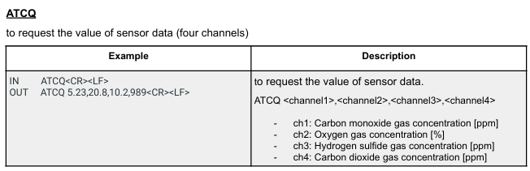
            <br>
            <b>AT Command 예시</b>
        </td>
    </tr>
</table>

서버는 일정 주기로 센서에 측정 요청 명령을 전송하고, 센서로부터 수신된
응답 데이터를 파싱하여 각 가스 항목별 측정 값으로 변환하여 응답합니다.


---

#### b) 경보 제어 방식 (USB 릴레이 모듈 연동)

Spring Boot 서버는 USB 통신을 통해 릴레이 모듈을 제어하며,
릴레이 모듈은 자체 접점 개폐를 통해 경광등 전원 회로를 ON/OFF 합니다.

<table align="center">
    <tr>
        <td align="center">
            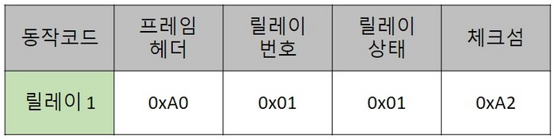
            <br>
            <b>릴레이 모듈 신호 예시 (On)</b>
        </td>
    </tr>
</table>

가스 수치가 기준치를 초과할 경우, 서버는 릴레이에 ON 신호를 전송하여
경광등 전원을 인가하고 경보를 발생시킵니다.

<table align="center">
    <tr>
        <td align="center">
            
            <br>
            <b>경보 동작 사진</b>
        </td>
    </tr>
</table>

---
 
#### c) 배기팬 상태 확인 방식 (DI 모듈 연동)

서버는 DI 모듈과 통신하여 배기팬의 실제 동작 여부를 확인합니다.

<table align="center">
    <tr>
        <td align="center">
            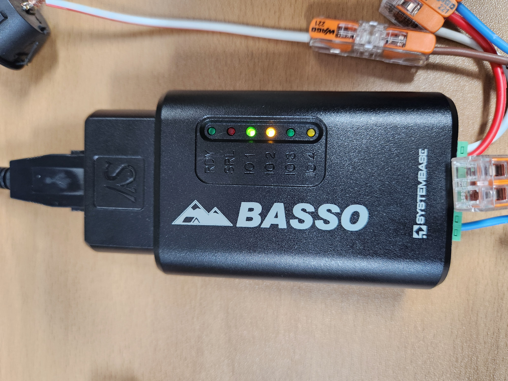
            <br>
            <b>배기팬 (On)</b>
        </td>
        <td align="center">
            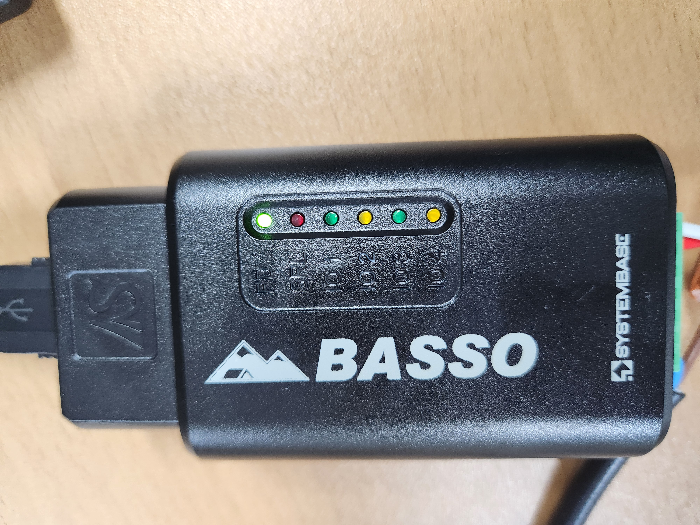
            <br>
            <b>배기팬 (Off)</b>
        </td>
    </tr>
</table>

배기팬은 무전압 접점(Dry Contact) 신호를 제공하지만,
DI 모듈(BASSO)의 입력은 외부 전압을 기준으로 동작하는
해당 신호를 입력으로 받아 팬의 ON/OFF 상태를 서버에 전달합니다.

이에 따라 배기팬의 무전압 접점 신호를
DI 모듈 입력 조건에 맞게 변환하기 위해
중간에 릴레이를 구성하여 신호를 전달하도록 설계하였습니다.

---

#### d) 배기팬 상태 확인 회로 구성
> 무전압 접점 신호를 DI 모듈 입력 조건에 맞게 변환하기 위해
신호 변환용 릴레이를 사용하였습니다.

배기팬의 무전압 접점 출력은 릴레이의 접점 입력(DIO)에 연결되며,
릴레이는 외부 전원을 사용하여 DI 모듈에 유전압 신호를 전달합니다.

릴레이가 동작하면 DI 모듈 입력 단자에 전압이 인가되고,
DI 모듈은 해당 신호를 기반으로 배기팬의 ON/OFF 상태를 판단합니다.

서버는 DI 모듈의 입력 상태를 조회하여
배기팬이 실제로 동작 중인지 여부를 확인합니다.

---

## 4. 설비 연동 및 배선 구성
### 4-1) 경광등 전원 제어 배선 구성
경광등은 DC 24V 전원을 사용하며,
검정 선은 (-), 흰 선은 (+) 극으로 구성되어 있습니다.

<table align="center">
    <tr>
        <td align="center">
            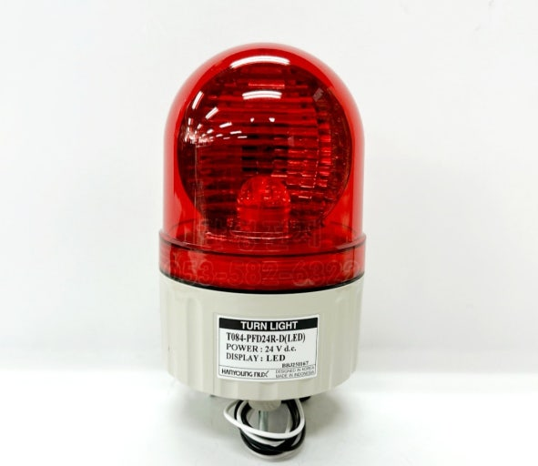
            <br>
            <b>경광등 사진</b>
        </td>
    </tr>
</table>

USB 릴레이 모듈은 전원선 중 (+) 극만을 개폐하는 구조로,
경광등의 (+) 선을 릴레이 접점에 연결하여 전원을 제어합니다.

---

### 4-2) USB 릴레이 모듈 단자 구성
USB 릴레이 모듈은 다음과 같은 단자를 제공합니다.

- **NC (Normally Closed)**
    - 사용하지 않음

- **COM (Common)**
    - 외부 DC 24V 전원의 (+) 극 연결

- **NO (Normally Open)**
    - 경광등의 (+) 선 연결

<table align="center">
    <tr>
        <td align="center">
            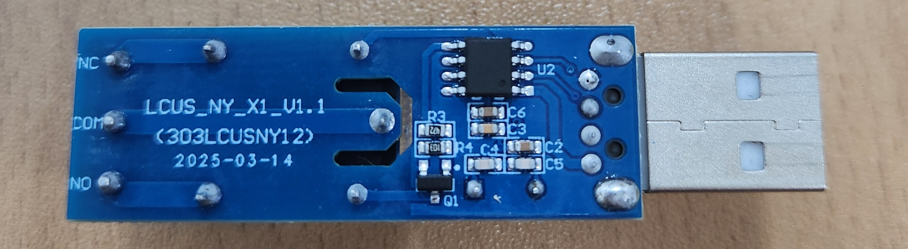
            <br>
            <b>USB 릴레이 모듈 사진1</b>
        </td>
        <td align="center">
            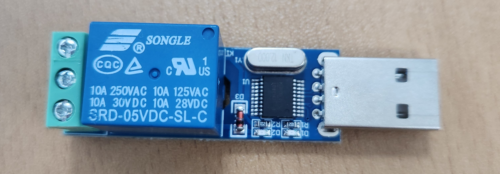
            <br>
            <b>USB 릴레이 모듈 사진2</b>
        </td>
    </tr>
</table>

릴레이 모듈은 단순한 스위치 역할을 수행하며,
서버 제어에 따라 COM과 NO 단자를 연결하거나 차단하여
경광등 전원 공급을 제어합니다.

<details>
<summary><b>👉 릴레이 모듈 사진 더보기 (On, Off)</b></summary>

<table align="center">
    <tr>
        <td align="center">
            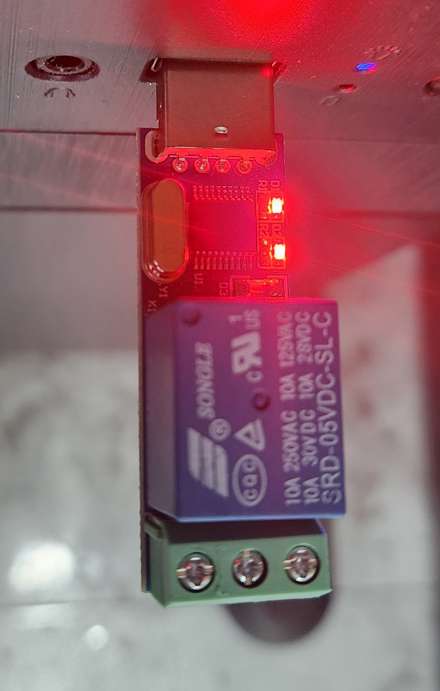
            <br>
            <b>USB 릴레이 모듈 (on)</b>
        </td>
        <td align="center">
            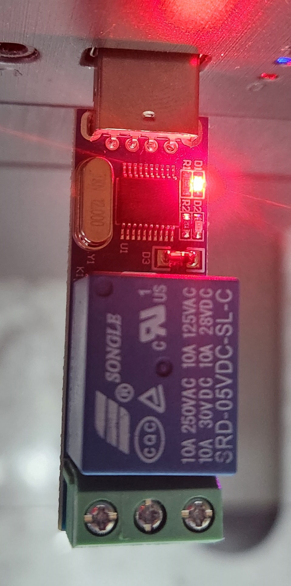
            <br>
            <b>USB 릴레이 모듈 (off)</b>
        </td>
    </tr>
</table>
</details>

---

### 4-3) 배기팬 무전압 접점 연동 구성
배기팬은 무전압 접점(Dry Contact) 출력을 제공하며, 해당 접점은 배기팬의
실제 동작 상태에 따라 열림(Open) / 닫힘(Close) 상태로 변화합니다.

이 시스템에서는 배기팬의 무전압 접점 신호를 DI 모듈의 입력 조건에 맞게 변환하기 위해
중간에 신호 변환용 릴레이를 구성하여 연동하였습니다.

<table align="center">
    <tr>
        <td align="center">
            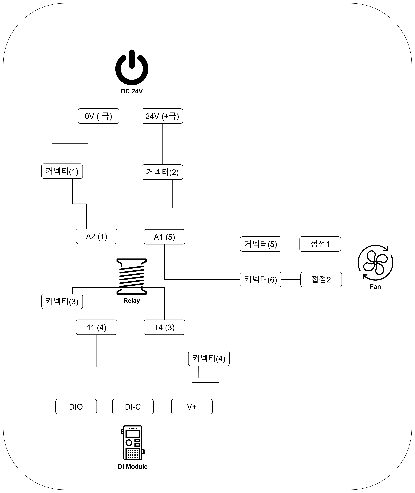
            <br>
            <b>배선 확인도 (동작 회로도)</b>
        </td>
    </tr>
</table>

> 이 구성은 DC 24V (+) 전원 흐름을 기준으로 이해하면 가장 직관적입니다.

1. DC 24V 전원 공급 및 기준 전압 구성
   - DC 24V 전원의 (+) 극에서 전원이 출력됩니다.
   - 해당 전원은 커넥터(2) 를 통해 분기되어 전달됩니다.
   - 분기된 전원은 커넥터(4) 로 전달되며, DI 모듈의 V+ 단자에 전원을 공급하고
     DI-C 단자와 점퍼(연결)되어 DI 입력의 기준 전압(reference)을 형성합니다.

이 단계에서 DI 모듈은 정상적으로 전원이 인가되고 DIO 입력은 V+ 기준의 Low Active 입력 구조로 준비됩니다.

2. 배기팬 동작에 따른 릴레이 코일 구동
    - DC 24V (+) 전원은 커넥터(2) 를 통해 커넥터(5) 방향으로도 전달됩니다.
    - 배기팬이 동작하면, 팬 내부의 무전압 접점(접점1, 접점2) 이 서로 연결됩니다
    - 이로 인해 DC 24V (+) 전원이 커넥터(6) 을 통해 릴레이 코일의 A1 단자로 전달됩니다.
    - 릴레이 코일의 A2 단자는 DC 24V의 0V(-극) 과 연결되어 있으므로,
      A1 → A2 방향으로 전류가 흐르게 됩니다
    - 코일에 전류가 흐르면 릴레이가 ON 상태로 전환되며, 접점 11(COM) – 14(NO) 가 서로 연결됩니다.


3. 릴레이 접점 동작에 따른 DI 입력 판별
    - 릴레이 접점이 ON 되면, DIO 단자(11)가 DC 24V의 0V(-극, 14)와 전기적으로 연결됩니다.
      (정확히는 커넥터(3) → 커넥터(1) → 0V)
    - 그 결과, DIO 입력은 V+ 기준 대비 전위가 크게 낮아지며 DI 모듈은 이를 ON 상태(1) 로 판단합니다.
    - 릴레이 접점이 DC 24V의 + 전압을 DI로 공급하는 것이 아니라 
      DIO를 0V로 끌어내리는 경로를 만들어 주는 것입니다.


---

### 추가 내용 A. 배기팬 상태 감지 상세 동작 원리
#### A-1) 전체 구성 요소 개요
배기팬
- 배기팬은 상태를 열림(Open) / 닫힘(Close)으로 표현하는 무전압 접점을 제공합니다.
- 배기팬 가동 시 공통선(COM)과 상태선(FAN1)이 쇼트(연결)되며,
  해당 접점은 전압을 생성하지 않는 단순 접점입니다.

릴레이
- 릴레이는 외부 DC 24V 전원을 사용하여 코일(A1/A2)을 구동합니다.
- 릴레이는 BASSO로 전압을 전달하지 않으며,
  단순히 다른 회로의 ON/OFF를 만들어주는 기계식 스위치 역할을 수행합니다.

BASSO DI 모듈 (BASSO-1040UTDIO)
- BASSO는 내부 기준 전압을 사용하여 입력 상태를 판단하며,
  외부 DC 24V 전원은 BASSO의 입력 판별 로직에 직접적으로 관여하지 않습니다.
- DI 입력은 전압 유무가 아닌, 기준 전압 대비 전위 변화를 기준으로 판단됩니다.

---

#### A-2) 릴레이 코일 동작 원리 (G2R-1-SN-DC24V)
<table align="center">
    <tr>
        <td align="center">
            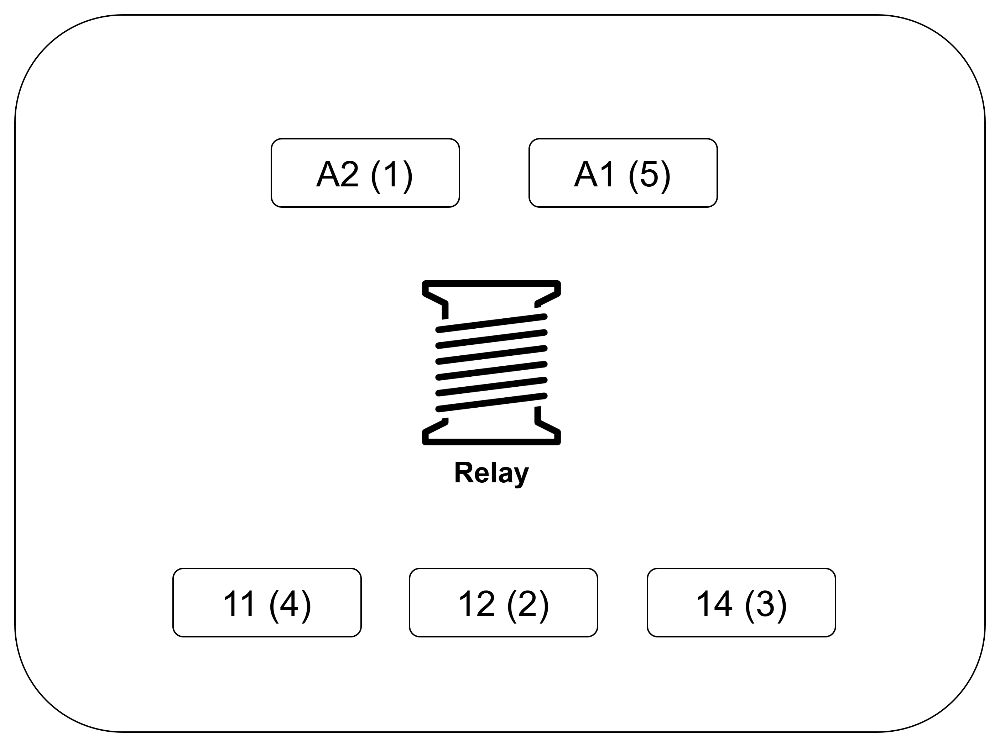
            <br>
            <b>릴레이 구성</b>
        </td>
        <td align="center">
            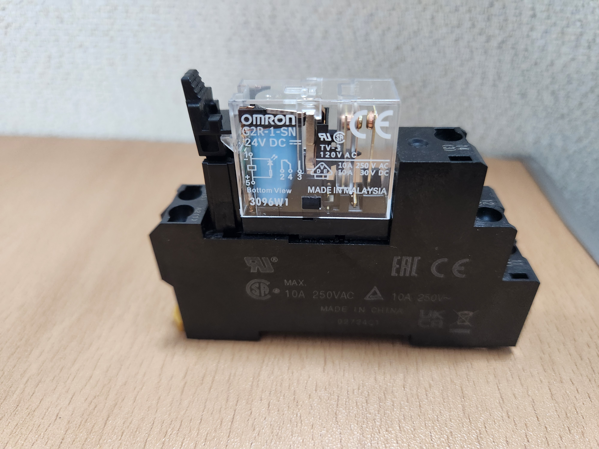
            <br>
            <b>릴레이 사진1</b>
        </td>
    </tr>
</table>

<details>
<summary><b>👉 릴레이 사진 더보기</b></summary>
<table align="center">
    <tr>
        <td align="center">
            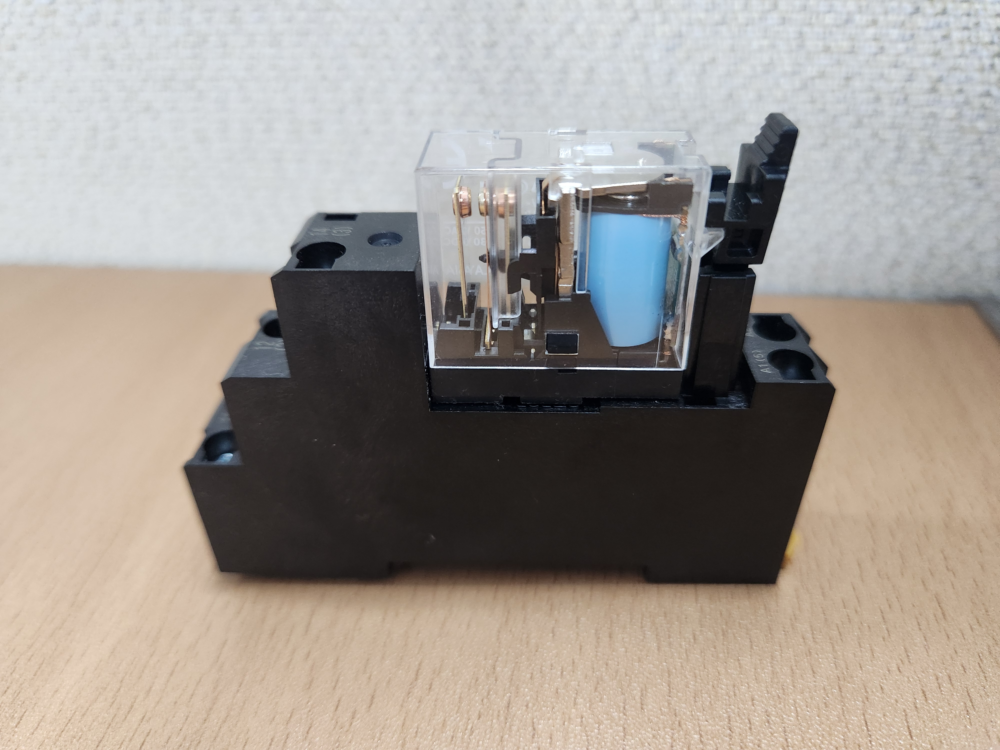
            <br>
            <b>릴레이 사진2</b>
        </td>
        <td align="center">
            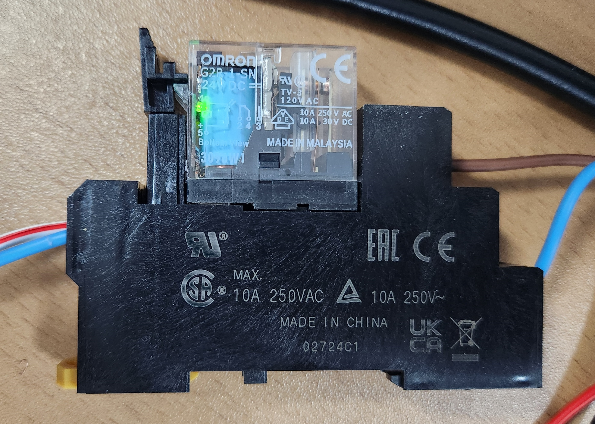
            <br>
            <b>릴레이 사진 (On)</b>
        </td>
    </tr>
</table>

<table align="center">
    <tr>
        <td align="center">
            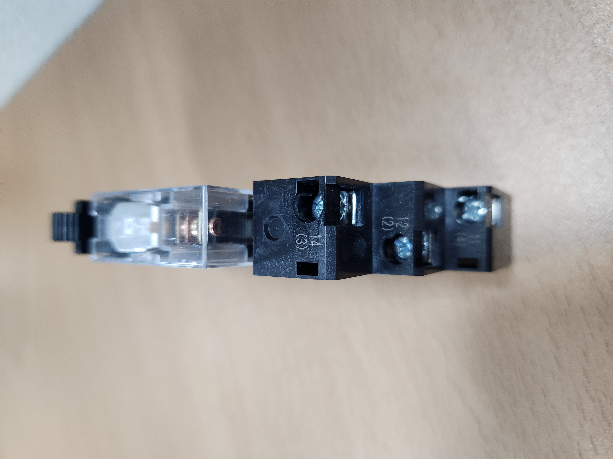
            <br>
            <b>릴레이 사진3</b>
        </td>
        <td align="center">
            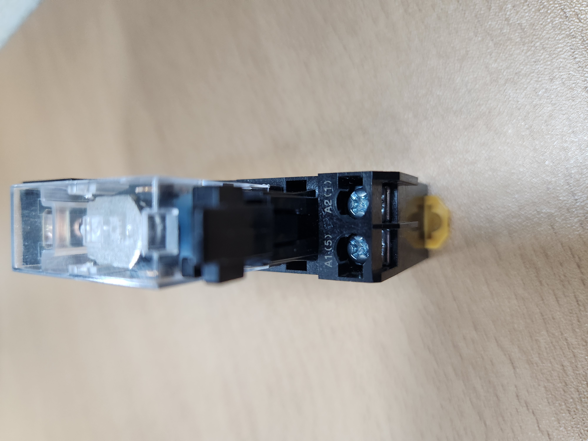
            <br>
            <b>릴레이 사진4</b>
        </td>
    </tr>
</table>
</details>

- A1/A2는 릴레이 코일 단자로, 릴레이 자체를 ON/OFF 하기 위한 입력입니다.
- 배기팬이 ON 되면 공통선과 상태선이 쇼트되며, DC 24V의 + 전압이 A1으로 전달됩니다.
- A1–A2 사이에 24V가 인가되면 코일에 전류가 흐르고, 릴레이 내부 접점이 ON 상태로 전환됩니다
- **해당 전압은 BASSO와 직접적인 전기적 연관이 없습니다**.

---

#### A-3) 릴레이 접점(11 / 14)과 BASSO 입력 판별
**릴레이 접점 배선 구성**
- 릴레이의 11(COM) 단자는 BASSO의 DIO 입력에 연결됩니다
- 릴레이의 14(NO) 단자는 외부 DC24V 전원 공급 단자의 0V(-극)에 연결됩니다

이때 릴레이 접점은 외부 DC24V 전원을 BASSO로 공급하는 역할을 하지 않으며,
단순히 BASSO DIO 입력을 0V(-극)로 끌어내릴 수 있는 경로를 제공하는 스위치 역할만 수행합니다

**BASSO DI 입력 판단 방식**
- BASSO는 DI 입력 판단을 위해 DI-C를 기준 전위로 사용합니다.
- 본 구성에서는 DI-C가 V+에 점퍼(연결)되어 있으며,
  BASSO는 DIO 입력 전위가 DI-C(V+)보다 낮아지는지를 기준으로 ON/OFF를 판단합니다.

**릴레이 ON 상태 (배기팬 동작)**
- 릴레이 접점 11–14가 닫힘
- DIO1이 외부 DC24V 전원의 0V(-극)과 직접 연결됨
- DIO1 전위가 DI-C(V+) 기준으로 급격히 낮아짐
- BASSO는 이름 ON(1) 상태로 판단함

**릴레이 OFF 상태 (배기팬 정지)**
- 릴레이 접점 11-14는 열려 있음
- DIO는 DC24V의 0V(-극)와 연결되지 않음
- DIO1은 BASSO 내부 기준 전위(V+) 근처를 유지
- BASSO는 이를 OFF(0) 상태로 판단함

---

## 5. 주요 기능
### 🔹 가스 센서 모니터링

> ※ 아래 화면에 표시된 가스 수치는 UI 동작 및 상태 전환 확인을 위한 테스트용 값이며,
> 실제 현장 측정값과는 무관합니다.

<table align="center">
    <tr>
        <td align="center">
            
            <br>
            <b>정상 화면</b>
        </td>
    </tr>
</table>

<table align="center">
    <tr>
        <td align="center">
            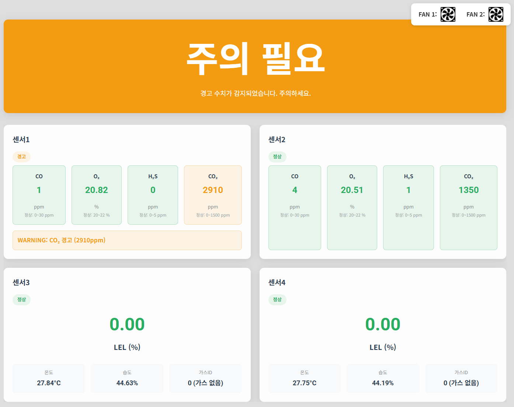
            <br>
            <b>주의 화면</b>
        </td>
    </tr>
</table>

<table align="center">
    <tr>
        <td align="center">
            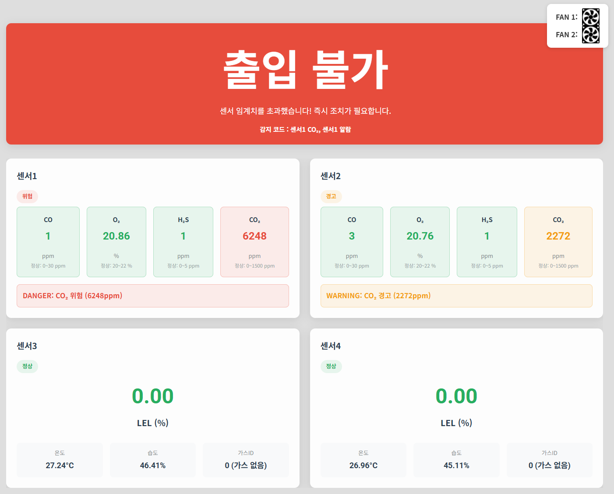
            <br>
            <b>경고 화면</b>
        </td>
    </tr>
</table>

- 임계치에 따른 출입 가능 여부 표시 화면

---

### 🔹 가스 임계치 기반 경보 제어
<table align="center">
    <tr>
        <td align="center">
            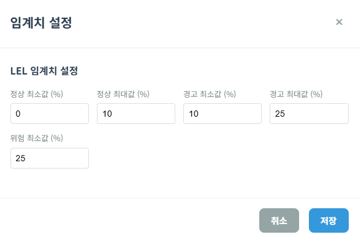
            <br>
            <b>LEL 센서 임계치 설정</b>
        </td>
        <td align="center">
            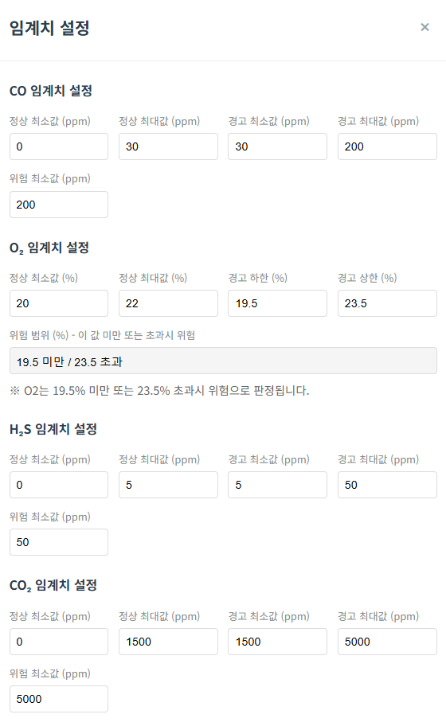
            <br>
            <b>KFG-U 센서 임계치 설정</b>
        </td>
    </tr>
</table>

- 가스 종류별로 경보 임계치를 개별 설정할 수 있습니다.
- 법적 기준 또는 사내 안전 규정이 변경되는 경우, 운영 중단 
  없이 임계치를 즉시 조정할 수 있습니다.

---

### 🔹 배기팬 실제 동작 상태 감지

> ※ 아래 화면에 표시된 가스 수치는 UI 동작 및 상태 전환 확인을 위한 테스트용 값이며,
> 실제 현장 측정값과는 무관합니다.

<table align="center">
    <tr>
        <td align="center">
            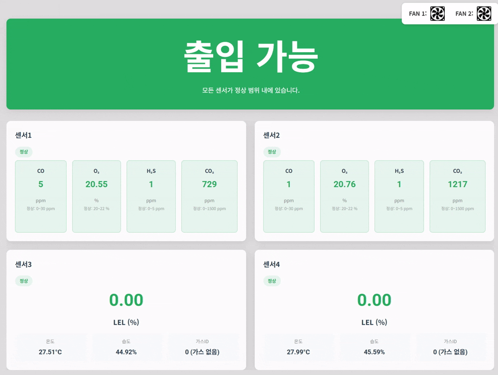
            <br>
            <b>배기팬 On</b>
        </td>
    </tr>
</table>

<table align="center">
    <tr>
        <td align="center">
            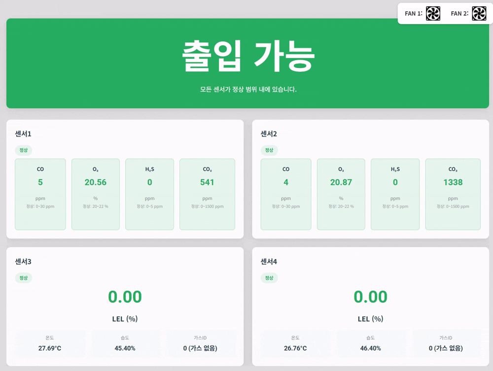
            <br>
            <b>배기팬 Off</b>
        </td>
    </tr>
</table>

- 배기팬이 실제로 동작 중인 경우, UI 상의 팬 아이콘이 회전 애니메이션으로 표시됩니다.
- 배기팬이 정지 상태인 경우, 팬 아이콘은 정지된 상태로 표시됩니다.

---

### 🔹 경보 기능 제어
<table align="center">
    <tr>
        <td align="center">
            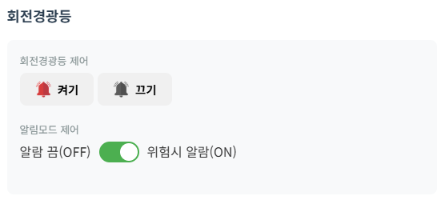
            <br>
            <b>경보 제어</b>
        </td>
    </tr>
</table>

- 작업자가 시설 내부에 존재하지 않는 상황에서는 불필요한
  경보 발생을 방지하기 위해 경보 기능을 비활성화 할 수 있습니다.

---

## 6. 변경 이력
**v1.1.2 미만**
- USB 포트를 통한 센서 유선 시리얼 통신을 처음 적용하는 단계로, 통신 특성과 예외 상황에 대한 이해가 충분하지 않은 상태에서 개발이 진행됨
- `Executor 프레임워크` 및 `Future 객체`에 대한 비동기 처리 구조 이해가 부족한
  상태에서 센서 통신 및 스케줄링 로직을 구성하여, 서버 중단, 동시성 문제 등 다수의 안정성 이슈가 존재함

**v1.1.2**
- 기존 센서 통신 및 스케줄링 로직 전면 점검
- 주요 오류 수정 후 안정 버전으로 최초 배포 (실제 작업 현장에 설치)

**v1.1.4**
- 경보 관련 요구사항이 추가되어 경보(알람) 기능 관련 코드 추가
- 경보 처리 로직 추가 이후 서버 멈춤(무한 대기) 문제가 다시 발생함

> 해당 문제(서버 멈춤)는, 클라이언트에서 새로고침 또는 재연결 등의 
> 요청을 보냈을 때 요청은 정상적으로 전달되지만, 서버가 이후 영구적으로
> 응답하지 않는 상태에 빠지는 현상으로 확인되었습니다.

> 해당 이슈는 v1.2.0에서 최종 해결되었습니다.

- 서버 무한 대기 문제에 대한 상세 원인 분석 및 해결 과정은
  [7. 주요 장애 이슈 및 분석](#7-주요-장애-이슈-및-분석) 섹션을 참고하시기 바랍니다.

**v1.1.5**
- v1.1.2의 센서 처리 로직을 유지한 상태에서 경보 기능을 동일 방식으로 재적용
- 여전히 서버 중단 문제가 재현됨

**v1.1.6**
- 경보 처리 로직 수정
- 센서 및 IO 작업 전반에 대한 코드 구조 개선 (리팩토링)
- 서버 중단 문제는 완전히 해결되지 않음

**v1.1.7**
- Future 객체 및 Executor 프레임워크에 대한 공부 이후, 비동기 처리 구조
  전면 리팩토링

**v1.2.0**
- 시리얼 통신 타임아웃 발생 시 포트를 즉시 종료하도록 코드 수정
  → 커널 레벨 인터럽트 무시 상황에서도 작업이 강제 종료되도록 개선
- 로그 처리 방식을 동기 처리 → 비동기 처리로 전환 
  → **서버 중단(무한 대기) 문제 최종 해결**

- 서버 무한 대기 문제에 대한 상세 원인 분석 및 해결 과정은
  [7. 주요 장애 이슈 및 분석](#7-주요-장애-이슈-및-분석) 섹션을 참고하시기 바랍니다.

**v1.2.1**
- 배기팬 관련 요구사항이 추가되어 해당 기능 관련 코드 추가
- DI 모듈 기반 배기팬 실제 동작 여부 감지 로직 적용

---

## 7. 주요 장애 이슈 및 분석

### 문제 현상
- 운영 중 새로고침 또는 재연결 요청을 수행할 경우, 매번 발생하지는 않지만,
  특정 조건에서 서버가 응답하지 않는 상태에 빠지는 문제가 간헐적으로 발생하였습니다.
- 해당 현상은 재현 조건이 명확하지 않은 비결정적인 형태로 나타났으며,
  동일한 요청을 반복해도 대부분 정상 동작하였으나,
  수 시간 또는 수일에 한 번 정도의 낮은 빈도로 서버가 응답하지 않는 상태로 영원히
  대기하는 문제가 간헐적으로 발생하였습니다.
- 해당 현상 발생 시 다음과 같은 특징이 관찰되었습니다.
    - JVM 프로세스는 정상 실행 중
    - CPU 사용률도 정상
    - `ctrl + c`로 프로세스를 강제 종료하거나, exe 파일을
      재시작하기 전까지 서버가 “멈춘 것처럼” 보이는 상태가 지속

초기에는 센서 I/O 작업에서 무한 대기 상태가 발생한 것으로 판단하고
해당 부분을 더 학습하고 개선하였으나, 문제가 해결되지 않았습니다.

이후, 쓰레드 덤프 분석을 통해 원인을 추적할 수 있음을 확인하고, 실제 실행 중인
프로세스를 대상으로 덤프 분석을 진행하였습니다.

---

### 환경
- OS: 윈도우 10
- 실행 방식: Java 애플리케이션을 launch4j를 사용하여
  exe 형태로 패키징하여 실행
- 로깅: SLF4J 인터페이스 기반 Logback 구현체 사용

---

### **쓰레드 덤프 분석 결과**
#### 1. HTTP 워커 쓰레드 상태 (exec-1 ~ exec-9)
- 아래는 HTTP 요청을 처리하는 톰캣 워커 쓰레드 중 일부입니다.

```
"http-nio-0.0.0.0-8081-exec-1" #55 [11076] daemon prio=5 os_prio=0 cpu=281.25ms elapsed=20349.23s tid=0x00000215efe4d600 nid=11076 waiting on condition  [0x00000073bf5fd000]
   java.lang.Thread.State: WAITING (parking)
	at jdk.internal.misc.Unsafe.park(java.base@21.0.8/Native Method)
	- parking to wait for  <0x000000008007a6d0> (a java.util.concurrent.locks.ReentrantLock$NonfairSync)
	at java.util.concurrent.locks.LockSupport.park(java.base@21.0.8/Unknown Source)
	at java.util.concurrent.locks.AbstractQueuedSynchronizer.acquire(java.base@21.0.8/Unknown Source)
	at java.util.concurrent.locks.AbstractQueuedSynchronizer.acquire(java.base@21.0.8/Unknown Source)
	at java.util.concurrent.locks.ReentrantLock$Sync.lock(java.base@21.0.8/Unknown Source)
	at java.util.concurrent.locks.ReentrantLock.lock(java.base@21.0.8/Unknown Source)
	at ch.qos.logback.core.OutputStreamAppender.writeBytes(OutputStreamAppender.java:211)
	at ch.qos.logback.core.OutputStreamAppender.writeOut(OutputStreamAppender.java:204)
	at ch.qos.logback.core.OutputStreamAppender.subAppend(OutputStreamAppender.java:257)
	at ch.qos.logback.core.OutputStreamAppender.append(OutputStreamAppender.java:111)
	at ch.qos.logback.core.UnsynchronizedAppenderBase.doAppend(UnsynchronizedAppenderBase.java:85)
        ... (이하 생략)
    
   Locked ownable synchronizers:
	- <0x0000000081ae0768> (a org.apache.tomcat.util.threads.ThreadPoolExecutor$Worker)
	- <0x000000008d6f38d0> (a java.util.concurrent.locks.ReentrantLock$NonfairSync)

~ (1~9까지 전부 같은 상태)
```

특징
- 모든 HTTP 워커 쓰레드가 동일하게 OutputStreamAppender.writeBytes()에서 대기
- Logback 내부의 ReentrantLock 획득을 기다리는 상태
- HTTP 요청 자체는 처리 중이지만, 로그 출력 단계에서 멈춤

---

#### 2. 출력 수행 중인 쓰레드 (exec-10)

```
"http-nio-0.0.0.0-8081-exec-10" #64 [4980] daemon prio=5 os_prio=0 cpu=109.38ms elapsed=20349.23s tid=0x00000215f191a310 nid=4980 runnable  [0x00000073bfefd000]
   java.lang.Thread.State: RUNNABLE
	at java.io.FileOutputStream.writeBytes(java.base@21.0.8/Native Method)
	at java.io.FileOutputStream.write(java.base@21.0.8/Unknown Source)
	at java.io.BufferedOutputStream.implWrite(java.base@21.0.8/Unknown Source)
	at java.io.BufferedOutputStream.write(java.base@21.0.8/Unknown Source)
	at java.io.PrintStream.implWrite(java.base@21.0.8/Unknown Source)
	at java.io.PrintStream.write(java.base@21.0.8/Unknown Source)
	at java.io.PrintStream.write(java.base@21.0.8/Unknown Source)
	at ch.qos.logback.core.joran.spi.ConsoleTarget$1.write(ConsoleTarget.java:39)
	at ch.qos.logback.core.OutputStreamAppender.writeByteArrayToOutputStreamWithPossibleFlush(OutputStreamAppender.java:234)
	at ch.qos.logback.core.OutputStreamAppender.writeBytes(OutputStreamAppender.java:217)
	at ch.qos.logback.core.OutputStreamAppender.writeOut(OutputStreamAppender.java:204)
	at ch.qos.logback.core.OutputStreamAppender.subAppend(OutputStreamAppender.java:257)
	at ch.qos.logback.core.OutputStreamAppender.append(OutputStreamAppender.java:111)
	at ch.qos.logback.core.UnsynchronizedAppenderBase.doAppend(UnsynchronizedAppenderBase.java:85)
        ... (이하 생략)
    
   Locked ownable synchronizers:
	- <0x000000008007a6d0> (a java.util.concurrent.locks.ReentrantLock$NonfairSync)
	- <0x00000000802a2628> (a java.util.concurrent.locks.ReentrantLock$NonfairSync)
	- <0x00000000802a2708> (a java.util.concurrent.locks.ReentrantLock$NonfairSync)
	- <0x0000000081adc128> (a org.apache.tomcat.util.threads.ThreadPoolExecutor$Worker)
	- <0x000000008265e760> (a java.util.concurrent.locks.ReentrantLock$NonfairSync)
```

특징
- 콘솔 출력(stdout)을 실제로 수행 중인 유일한 쓰레드
- Logback의 OutputStreamAppender 내부 락을 점유한 상태
- 다른 HTTP 워커 쓰레드들은 이 락을 기다리며 전부 대기중

---

### 문제 발생 메커니즘 정리
1. HTTP 요청 유입
2. LogFilter 진입
3. ConsoleAppender 접근
4. 단일 OutputStream에 대한 ReentrantLock 경쟁 발생
5. 1개 쓰레드(`exec-10`)만 출력 수행. 나머지 HTTP 워커 쓰레드 전부 락 대기

#### 핵심 문제
- `exec-10`이 수행중인 FileOutputStream.writeBytes()가 OS 레벨 I/O에서
  반환되지 않음
- FileOutputStream.writeBytes()는 JVM 내부 로직이 아니라
  OS 레벨의 I/O입니다. 한 번 커널로 내려가서 I/O 완료 신호가 안오면, JVM은
  그 쓰레드를 깨울 수가 없습니다.
- Interrupt, 타임아웃 등 모든 JVM 레벨의 제어가 무력화됨
- 결과적으로 HTTP 워커 쓰레드 전체가 로그 출력 지점에서 무한 대기

<br>

#### 윈도우 환경에서 발생할 수 있는 원인
> 윈도우 환경에서는 파일 또는 콘솔 I/O가 단순히 느려지는 수준을 넘어,
> 커널 레벨에서 장시간 블로킹 되거나 I/O 완료 이벤트가 정상적으로 반환되지 않는
> 상태에 진입하는 경우가 발생할 수 있습니다.
>
> 대표적으로 다음과 같은 상황들이 원인이 될 수 있습니다.
> 1. 백신/보안 프로그램 작업
> 2. 외부 프로세스가 동일 파일 핸들을 사용 중인 경우
> 3. 파일 핸들이 잠금 상태일 때
> 4. 디스크 캐시 flush 가 지연될 때
> 5. OneDrive/동기화 프로그램이 파일을 잡고 있을 때
     > <br> 등이 있습니다.
>
> 정확한 단일 원인을 특정할 수는 없으나, OS 레벨에서 I/O 완료 응답이 반환되지 않는
> 상황이 발생한 것이 이번 문제의 직접적인 원인으로 확정하였습니다.

<br>
<details>
<summary><b>👉 쓰레드 덤프 전체 보기 (HTTP 관련 쓰레드)</b></summary>

```
"http-nio-0.0.0.0-8081-exec-1" #55 [11076] daemon prio=5 os_prio=0 cpu=281.25ms elapsed=20349.23s tid=0x00000215efe4d600 nid=11076 waiting on condition  [0x00000073bf5fd000]
   java.lang.Thread.State: WAITING (parking)
	at jdk.internal.misc.Unsafe.park(java.base@21.0.8/Native Method)
	- parking to wait for  <0x000000008007a6d0> (a java.util.concurrent.locks.ReentrantLock$NonfairSync)
	at java.util.concurrent.locks.LockSupport.park(java.base@21.0.8/Unknown Source)
	at java.util.concurrent.locks.AbstractQueuedSynchronizer.acquire(java.base@21.0.8/Unknown Source)
	at java.util.concurrent.locks.AbstractQueuedSynchronizer.acquire(java.base@21.0.8/Unknown Source)
	at java.util.concurrent.locks.ReentrantLock$Sync.lock(java.base@21.0.8/Unknown Source)
	at java.util.concurrent.locks.ReentrantLock.lock(java.base@21.0.8/Unknown Source)
	at ch.qos.logback.core.OutputStreamAppender.writeBytes(OutputStreamAppender.java:211)
	at ch.qos.logback.core.OutputStreamAppender.writeOut(OutputStreamAppender.java:204)
	at ch.qos.logback.core.OutputStreamAppender.subAppend(OutputStreamAppender.java:257)
	at ch.qos.logback.core.OutputStreamAppender.append(OutputStreamAppender.java:111)
	at ch.qos.logback.core.UnsynchronizedAppenderBase.doAppend(UnsynchronizedAppenderBase.java:85)
	at ch.qos.logback.core.spi.AppenderAttachableImpl.appendLoopOnAppenders(AppenderAttachableImpl.java:51)
	at ch.qos.logback.classic.Logger.appendLoopOnAppenders(Logger.java:272)
	at ch.qos.logback.classic.Logger.callAppenders(Logger.java:259)
	at ch.qos.logback.classic.Logger.buildLoggingEventAndAppend(Logger.java:426)
	at ch.qos.logback.classic.Logger.filterAndLog_2(Logger.java:419)
	at ch.qos.logback.classic.Logger.info(Logger.java:592)
	at com.elim.server.gas_monitoring.security.filter.LogFilter.doFilterInternal(LogFilter.java:43)
	at org.springframework.web.filter.OncePerRequestFilter.doFilter(OncePerRequestFilter.java:116)
	at org.apache.catalina.core.ApplicationFilterChain.internalDoFilter(ApplicationFilterChain.java:164)
	at org.apache.catalina.core.ApplicationFilterChain.doFilter(ApplicationFilterChain.java:140)
	at org.springframework.web.filter.RequestContextFilter.doFilterInternal(RequestContextFilter.java:100)
	at org.springframework.web.filter.OncePerRequestFilter.doFilter(OncePerRequestFilter.java:116)
	at org.apache.catalina.core.ApplicationFilterChain.internalDoFilter(ApplicationFilterChain.java:164)
	at org.apache.catalina.core.ApplicationFilterChain.doFilter(ApplicationFilterChain.java:140)
	at org.springframework.web.filter.FormContentFilter.doFilterInternal(FormContentFilter.java:93)
	at org.springframework.web.filter.OncePerRequestFilter.doFilter(OncePerRequestFilter.java:116)
	at org.apache.catalina.core.ApplicationFilterChain.internalDoFilter(ApplicationFilterChain.java:164)
	at org.apache.catalina.core.ApplicationFilterChain.doFilter(ApplicationFilterChain.java:140)
	at org.springframework.web.filter.CharacterEncodingFilter.doFilterInternal(CharacterEncodingFilter.java:201)
	at org.springframework.web.filter.OncePerRequestFilter.doFilter(OncePerRequestFilter.java:116)
	at org.apache.catalina.core.ApplicationFilterChain.internalDoFilter(ApplicationFilterChain.java:164)
	at org.apache.catalina.core.ApplicationFilterChain.doFilter(ApplicationFilterChain.java:140)
	at org.apache.catalina.core.StandardWrapperValve.invoke(StandardWrapperValve.java:167)
	at org.apache.catalina.core.StandardContextValve.invoke(StandardContextValve.java:90)
	at org.apache.catalina.authenticator.AuthenticatorBase.invoke(AuthenticatorBase.java:483)
	at org.apache.catalina.core.StandardHostValve.invoke(StandardHostValve.java:116)
	at org.apache.catalina.valves.ErrorReportValve.invoke(ErrorReportValve.java:93)
	at org.apache.catalina.core.StandardEngineValve.invoke(StandardEngineValve.java:74)
	at org.apache.catalina.connector.CoyoteAdapter.service(CoyoteAdapter.java:344)
	at org.apache.coyote.http11.Http11Processor.service(Http11Processor.java:398)
	at org.apache.coyote.AbstractProcessorLight.process(AbstractProcessorLight.java:63)
	at org.apache.coyote.AbstractProtocol$ConnectionHandler.process(AbstractProtocol.java:903)
	at org.apache.tomcat.util.net.NioEndpoint$SocketProcessor.doRun(NioEndpoint.java:1776)
	at org.apache.tomcat.util.net.SocketProcessorBase.run(SocketProcessorBase.java:52)
	at org.apache.tomcat.util.threads.ThreadPoolExecutor.runWorker(ThreadPoolExecutor.java:975)
	at org.apache.tomcat.util.threads.ThreadPoolExecutor$Worker.run(ThreadPoolExecutor.java:493)
	at org.apache.tomcat.util.threads.TaskThread$WrappingRunnable.run(TaskThread.java:63)
	at java.lang.Thread.runWith(java.base@21.0.8/Unknown Source)
	at java.lang.Thread.run(java.base@21.0.8/Unknown Source)

   Locked ownable synchronizers:
	- <0x0000000081ae0768> (a org.apache.tomcat.util.threads.ThreadPoolExecutor$Worker)
	- <0x000000008d6f38d0> (a java.util.concurrent.locks.ReentrantLock$NonfairSync)

"http-nio-0.0.0.0-8081-exec-2" #56 [5192] daemon prio=5 os_prio=0 cpu=218.75ms elapsed=20349.23s tid=0x00000215efe48dd0 nid=5192 waiting on condition  [0x00000073bf6ff000]
   java.lang.Thread.State: WAITING (parking)
	at jdk.internal.misc.Unsafe.park(java.base@21.0.8/Native Method)
	- parking to wait for  <0x0000000081ae0690> (a java.util.concurrent.locks.AbstractQueuedSynchronizer$ConditionObject)
	at java.util.concurrent.locks.LockSupport.park(java.base@21.0.8/Unknown Source)
	at java.util.concurrent.locks.AbstractQueuedSynchronizer$ConditionNode.block(java.base@21.0.8/Unknown Source)
	at java.util.concurrent.ForkJoinPool.unmanagedBlock(java.base@21.0.8/Unknown Source)
	at java.util.concurrent.ForkJoinPool.managedBlock(java.base@21.0.8/Unknown Source)
	at java.util.concurrent.locks.AbstractQueuedSynchronizer$ConditionObject.await(java.base@21.0.8/Unknown Source)
	at java.util.concurrent.LinkedBlockingQueue.take(java.base@21.0.8/Unknown Source)
	at org.apache.tomcat.util.threads.TaskQueue.take(TaskQueue.java:106)
	at org.apache.tomcat.util.threads.TaskQueue.take(TaskQueue.java:31)
	at org.apache.tomcat.util.threads.ThreadPoolExecutor.getTask(ThreadPoolExecutor.java:915)
	at org.apache.tomcat.util.threads.ThreadPoolExecutor.runWorker(ThreadPoolExecutor.java:962)
	at org.apache.tomcat.util.threads.ThreadPoolExecutor$Worker.run(ThreadPoolExecutor.java:493)
	at org.apache.tomcat.util.threads.TaskThread$WrappingRunnable.run(TaskThread.java:63)
	at java.lang.Thread.runWith(java.base@21.0.8/Unknown Source)
	at java.lang.Thread.run(java.base@21.0.8/Unknown Source)

   Locked ownable synchronizers:
	- None

"http-nio-0.0.0.0-8081-exec-3" #57 [7372] daemon prio=5 os_prio=0 cpu=140.62ms elapsed=20349.23s tid=0x00000215efe4e320 nid=7372 waiting on condition  [0x00000073bf7fd000]
   java.lang.Thread.State: WAITING (parking)
	at jdk.internal.misc.Unsafe.park(java.base@21.0.8/Native Method)
	- parking to wait for  <0x000000008007a6d0> (a java.util.concurrent.locks.ReentrantLock$NonfairSync)
	at java.util.concurrent.locks.LockSupport.park(java.base@21.0.8/Unknown Source)
	at java.util.concurrent.locks.AbstractQueuedSynchronizer.acquire(java.base@21.0.8/Unknown Source)
	at java.util.concurrent.locks.AbstractQueuedSynchronizer.acquire(java.base@21.0.8/Unknown Source)
	at java.util.concurrent.locks.ReentrantLock$Sync.lock(java.base@21.0.8/Unknown Source)
	at java.util.concurrent.locks.ReentrantLock.lock(java.base@21.0.8/Unknown Source)
	at ch.qos.logback.core.OutputStreamAppender.writeBytes(OutputStreamAppender.java:211)
	at ch.qos.logback.core.OutputStreamAppender.writeOut(OutputStreamAppender.java:204)
	at ch.qos.logback.core.OutputStreamAppender.subAppend(OutputStreamAppender.java:257)
	at ch.qos.logback.core.OutputStreamAppender.append(OutputStreamAppender.java:111)
	at ch.qos.logback.core.UnsynchronizedAppenderBase.doAppend(UnsynchronizedAppenderBase.java:85)
	at ch.qos.logback.core.spi.AppenderAttachableImpl.appendLoopOnAppenders(AppenderAttachableImpl.java:51)
	at ch.qos.logback.classic.Logger.appendLoopOnAppenders(Logger.java:272)
	at ch.qos.logback.classic.Logger.callAppenders(Logger.java:259)
	at ch.qos.logback.classic.Logger.buildLoggingEventAndAppend(Logger.java:426)
	at ch.qos.logback.classic.Logger.filterAndLog_2(Logger.java:419)
	at ch.qos.logback.classic.Logger.info(Logger.java:592)
	at com.elim.server.gas_monitoring.security.filter.LogFilter.doFilterInternal(LogFilter.java:43)
	at org.springframework.web.filter.OncePerRequestFilter.doFilter(OncePerRequestFilter.java:116)
	at org.apache.catalina.core.ApplicationFilterChain.internalDoFilter(ApplicationFilterChain.java:164)
	at org.apache.catalina.core.ApplicationFilterChain.doFilter(ApplicationFilterChain.java:140)
	at org.springframework.web.filter.RequestContextFilter.doFilterInternal(RequestContextFilter.java:100)
	at org.springframework.web.filter.OncePerRequestFilter.doFilter(OncePerRequestFilter.java:116)
	at org.apache.catalina.core.ApplicationFilterChain.internalDoFilter(ApplicationFilterChain.java:164)
	at org.apache.catalina.core.ApplicationFilterChain.doFilter(ApplicationFilterChain.java:140)
	at org.springframework.web.filter.FormContentFilter.doFilterInternal(FormContentFilter.java:93)
	at org.springframework.web.filter.OncePerRequestFilter.doFilter(OncePerRequestFilter.java:116)
	at org.apache.catalina.core.ApplicationFilterChain.internalDoFilter(ApplicationFilterChain.java:164)
	at org.apache.catalina.core.ApplicationFilterChain.doFilter(ApplicationFilterChain.java:140)
	at org.springframework.web.filter.CharacterEncodingFilter.doFilterInternal(CharacterEncodingFilter.java:201)
	at org.springframework.web.filter.OncePerRequestFilter.doFilter(OncePerRequestFilter.java:116)
	at org.apache.catalina.core.ApplicationFilterChain.internalDoFilter(ApplicationFilterChain.java:164)
	at org.apache.catalina.core.ApplicationFilterChain.doFilter(ApplicationFilterChain.java:140)
	at org.apache.catalina.core.StandardWrapperValve.invoke(StandardWrapperValve.java:167)
	at org.apache.catalina.core.StandardContextValve.invoke(StandardContextValve.java:90)
	at org.apache.catalina.authenticator.AuthenticatorBase.invoke(AuthenticatorBase.java:483)
	at org.apache.catalina.core.StandardHostValve.invoke(StandardHostValve.java:116)
	at org.apache.catalina.valves.ErrorReportValve.invoke(ErrorReportValve.java:93)
	at org.apache.catalina.core.StandardEngineValve.invoke(StandardEngineValve.java:74)
	at org.apache.catalina.connector.CoyoteAdapter.service(CoyoteAdapter.java:344)
	at org.apache.coyote.http11.Http11Processor.service(Http11Processor.java:398)
	at org.apache.coyote.AbstractProcessorLight.process(AbstractProcessorLight.java:63)
	at org.apache.coyote.AbstractProtocol$ConnectionHandler.process(AbstractProtocol.java:903)
	at org.apache.tomcat.util.net.NioEndpoint$SocketProcessor.doRun(NioEndpoint.java:1776)
	at org.apache.tomcat.util.net.SocketProcessorBase.run(SocketProcessorBase.java:52)
	at org.apache.tomcat.util.threads.ThreadPoolExecutor.runWorker(ThreadPoolExecutor.java:975)
	at org.apache.tomcat.util.threads.ThreadPoolExecutor$Worker.run(ThreadPoolExecutor.java:493)
	at org.apache.tomcat.util.threads.TaskThread$WrappingRunnable.run(TaskThread.java:63)
	at java.lang.Thread.runWith(java.base@21.0.8/Unknown Source)
	at java.lang.Thread.run(java.base@21.0.8/Unknown Source)

   Locked ownable synchronizers:
	- <0x0000000081ae2a38> (a org.apache.tomcat.util.threads.ThreadPoolExecutor$Worker)
	- <0x00000000826171c0> (a java.util.concurrent.locks.ReentrantLock$NonfairSync)

"http-nio-0.0.0.0-8081-exec-4" #58 [20392] daemon prio=5 os_prio=0 cpu=125.00ms elapsed=20349.23s tid=0x00000215efe49460 nid=20392 waiting on condition  [0x00000073bf8fd000]
   java.lang.Thread.State: WAITING (parking)
	at jdk.internal.misc.Unsafe.park(java.base@21.0.8/Native Method)
	- parking to wait for  <0x000000008007a6d0> (a java.util.concurrent.locks.ReentrantLock$NonfairSync)
	at java.util.concurrent.locks.LockSupport.park(java.base@21.0.8/Unknown Source)
	at java.util.concurrent.locks.AbstractQueuedSynchronizer.acquire(java.base@21.0.8/Unknown Source)
	at java.util.concurrent.locks.AbstractQueuedSynchronizer.acquire(java.base@21.0.8/Unknown Source)
	at java.util.concurrent.locks.ReentrantLock$Sync.lock(java.base@21.0.8/Unknown Source)
	at java.util.concurrent.locks.ReentrantLock.lock(java.base@21.0.8/Unknown Source)
	at ch.qos.logback.core.OutputStreamAppender.writeBytes(OutputStreamAppender.java:211)
	at ch.qos.logback.core.OutputStreamAppender.writeOut(OutputStreamAppender.java:204)
	at ch.qos.logback.core.OutputStreamAppender.subAppend(OutputStreamAppender.java:257)
	at ch.qos.logback.core.OutputStreamAppender.append(OutputStreamAppender.java:111)
	at ch.qos.logback.core.UnsynchronizedAppenderBase.doAppend(UnsynchronizedAppenderBase.java:85)
	at ch.qos.logback.core.spi.AppenderAttachableImpl.appendLoopOnAppenders(AppenderAttachableImpl.java:51)
	at ch.qos.logback.classic.Logger.appendLoopOnAppenders(Logger.java:272)
	at ch.qos.logback.classic.Logger.callAppenders(Logger.java:259)
	at ch.qos.logback.classic.Logger.buildLoggingEventAndAppend(Logger.java:426)
	at ch.qos.logback.classic.Logger.filterAndLog_2(Logger.java:419)
	at ch.qos.logback.classic.Logger.info(Logger.java:592)
	at com.elim.server.gas_monitoring.security.filter.LogFilter.doFilterInternal(LogFilter.java:43)
	at org.springframework.web.filter.OncePerRequestFilter.doFilter(OncePerRequestFilter.java:116)
	at org.apache.catalina.core.ApplicationFilterChain.internalDoFilter(ApplicationFilterChain.java:164)
	at org.apache.catalina.core.ApplicationFilterChain.doFilter(ApplicationFilterChain.java:140)
	at org.springframework.web.filter.RequestContextFilter.doFilterInternal(RequestContextFilter.java:100)
	at org.springframework.web.filter.OncePerRequestFilter.doFilter(OncePerRequestFilter.java:116)
	at org.apache.catalina.core.ApplicationFilterChain.internalDoFilter(ApplicationFilterChain.java:164)
	at org.apache.catalina.core.ApplicationFilterChain.doFilter(ApplicationFilterChain.java:140)
	at org.springframework.web.filter.FormContentFilter.doFilterInternal(FormContentFilter.java:93)
	at org.springframework.web.filter.OncePerRequestFilter.doFilter(OncePerRequestFilter.java:116)
	at org.apache.catalina.core.ApplicationFilterChain.internalDoFilter(ApplicationFilterChain.java:164)
	at org.apache.catalina.core.ApplicationFilterChain.doFilter(ApplicationFilterChain.java:140)
	at org.springframework.web.filter.CharacterEncodingFilter.doFilterInternal(CharacterEncodingFilter.java:201)
	at org.springframework.web.filter.OncePerRequestFilter.doFilter(OncePerRequestFilter.java:116)
	at org.apache.catalina.core.ApplicationFilterChain.internalDoFilter(ApplicationFilterChain.java:164)
	at org.apache.catalina.core.ApplicationFilterChain.doFilter(ApplicationFilterChain.java:140)
	at org.apache.catalina.core.StandardWrapperValve.invoke(StandardWrapperValve.java:167)
	at org.apache.catalina.core.StandardContextValve.invoke(StandardContextValve.java:90)
	at org.apache.catalina.authenticator.AuthenticatorBase.invoke(AuthenticatorBase.java:483)
	at org.apache.catalina.core.StandardHostValve.invoke(StandardHostValve.java:116)
	at org.apache.catalina.valves.ErrorReportValve.invoke(ErrorReportValve.java:93)
	at org.apache.catalina.core.StandardEngineValve.invoke(StandardEngineValve.java:74)
	at org.apache.catalina.connector.CoyoteAdapter.service(CoyoteAdapter.java:344)
	at org.apache.coyote.http11.Http11Processor.service(Http11Processor.java:398)
	at org.apache.coyote.AbstractProcessorLight.process(AbstractProcessorLight.java:63)
	at org.apache.coyote.AbstractProtocol$ConnectionHandler.process(AbstractProtocol.java:903)
	at org.apache.tomcat.util.net.NioEndpoint$SocketProcessor.doRun(NioEndpoint.java:1776)
	at org.apache.tomcat.util.net.SocketProcessorBase.run(SocketProcessorBase.java:52)
	at org.apache.tomcat.util.threads.ThreadPoolExecutor.runWorker(ThreadPoolExecutor.java:975)
	at org.apache.tomcat.util.threads.ThreadPoolExecutor$Worker.run(ThreadPoolExecutor.java:493)
	at org.apache.tomcat.util.threads.TaskThread$WrappingRunnable.run(TaskThread.java:63)
	at java.lang.Thread.runWith(java.base@21.0.8/Unknown Source)
	at java.lang.Thread.run(java.base@21.0.8/Unknown Source)

   Locked ownable synchronizers:
	- <0x0000000081ae08a0> (a org.apache.tomcat.util.threads.ThreadPoolExecutor$Worker)
	- <0x0000000082602758> (a java.util.concurrent.locks.ReentrantLock$NonfairSync)

"http-nio-0.0.0.0-8081-exec-5" #59 [12688] daemon prio=5 os_prio=0 cpu=187.50ms elapsed=20349.23s tid=0x00000215efe4e9b0 nid=12688 waiting on condition  [0x00000073bf9fd000]
   java.lang.Thread.State: WAITING (parking)
	at jdk.internal.misc.Unsafe.park(java.base@21.0.8/Native Method)
	- parking to wait for  <0x000000008007a6d0> (a java.util.concurrent.locks.ReentrantLock$NonfairSync)
	at java.util.concurrent.locks.LockSupport.park(java.base@21.0.8/Unknown Source)
	at java.util.concurrent.locks.AbstractQueuedSynchronizer.acquire(java.base@21.0.8/Unknown Source)
	at java.util.concurrent.locks.AbstractQueuedSynchronizer.acquire(java.base@21.0.8/Unknown Source)
	at java.util.concurrent.locks.ReentrantLock$Sync.lock(java.base@21.0.8/Unknown Source)
	at java.util.concurrent.locks.ReentrantLock.lock(java.base@21.0.8/Unknown Source)
	at ch.qos.logback.core.OutputStreamAppender.writeBytes(OutputStreamAppender.java:211)
	at ch.qos.logback.core.OutputStreamAppender.writeOut(OutputStreamAppender.java:204)
	at ch.qos.logback.core.OutputStreamAppender.subAppend(OutputStreamAppender.java:257)
	at ch.qos.logback.core.OutputStreamAppender.append(OutputStreamAppender.java:111)
	at ch.qos.logback.core.UnsynchronizedAppenderBase.doAppend(UnsynchronizedAppenderBase.java:85)
	at ch.qos.logback.core.spi.AppenderAttachableImpl.appendLoopOnAppenders(AppenderAttachableImpl.java:51)
	at ch.qos.logback.classic.Logger.appendLoopOnAppenders(Logger.java:272)
	at ch.qos.logback.classic.Logger.callAppenders(Logger.java:259)
	at ch.qos.logback.classic.Logger.buildLoggingEventAndAppend(Logger.java:426)
	at ch.qos.logback.classic.Logger.filterAndLog_2(Logger.java:419)
	at ch.qos.logback.classic.Logger.info(Logger.java:592)
	at com.elim.server.gas_monitoring.security.filter.LogFilter.doFilterInternal(LogFilter.java:43)
	at org.springframework.web.filter.OncePerRequestFilter.doFilter(OncePerRequestFilter.java:116)
	at org.apache.catalina.core.ApplicationFilterChain.internalDoFilter(ApplicationFilterChain.java:164)
	at org.apache.catalina.core.ApplicationFilterChain.doFilter(ApplicationFilterChain.java:140)
	at org.springframework.web.filter.RequestContextFilter.doFilterInternal(RequestContextFilter.java:100)
	at org.springframework.web.filter.OncePerRequestFilter.doFilter(OncePerRequestFilter.java:116)
	at org.apache.catalina.core.ApplicationFilterChain.internalDoFilter(ApplicationFilterChain.java:164)
	at org.apache.catalina.core.ApplicationFilterChain.doFilter(ApplicationFilterChain.java:140)
	at org.springframework.web.filter.FormContentFilter.doFilterInternal(FormContentFilter.java:93)
	at org.springframework.web.filter.OncePerRequestFilter.doFilter(OncePerRequestFilter.java:116)
	at org.apache.catalina.core.ApplicationFilterChain.internalDoFilter(ApplicationFilterChain.java:164)
	at org.apache.catalina.core.ApplicationFilterChain.doFilter(ApplicationFilterChain.java:140)
	at org.springframework.web.filter.CharacterEncodingFilter.doFilterInternal(CharacterEncodingFilter.java:201)
	at org.springframework.web.filter.OncePerRequestFilter.doFilter(OncePerRequestFilter.java:116)
	at org.apache.catalina.core.ApplicationFilterChain.internalDoFilter(ApplicationFilterChain.java:164)
	at org.apache.catalina.core.ApplicationFilterChain.doFilter(ApplicationFilterChain.java:140)
	at org.apache.catalina.core.StandardWrapperValve.invoke(StandardWrapperValve.java:167)
	at org.apache.catalina.core.StandardContextValve.invoke(StandardContextValve.java:90)
	at org.apache.catalina.authenticator.AuthenticatorBase.invoke(AuthenticatorBase.java:483)
	at org.apache.catalina.core.StandardHostValve.invoke(StandardHostValve.java:116)
	at org.apache.catalina.valves.ErrorReportValve.invoke(ErrorReportValve.java:93)
	at org.apache.catalina.core.StandardEngineValve.invoke(StandardEngineValve.java:74)
	at org.apache.catalina.connector.CoyoteAdapter.service(CoyoteAdapter.java:344)
	at org.apache.coyote.http11.Http11Processor.service(Http11Processor.java:398)
	at org.apache.coyote.AbstractProcessorLight.process(AbstractProcessorLight.java:63)
	at org.apache.coyote.AbstractProtocol$ConnectionHandler.process(AbstractProtocol.java:903)
	at org.apache.tomcat.util.net.NioEndpoint$SocketProcessor.doRun(NioEndpoint.java:1776)
	at org.apache.tomcat.util.net.SocketProcessorBase.run(SocketProcessorBase.java:52)
	at org.apache.tomcat.util.threads.ThreadPoolExecutor.runWorker(ThreadPoolExecutor.java:975)
	at org.apache.tomcat.util.threads.ThreadPoolExecutor$Worker.run(ThreadPoolExecutor.java:493)
	at org.apache.tomcat.util.threads.TaskThread$WrappingRunnable.run(TaskThread.java:63)
	at java.lang.Thread.runWith(java.base@21.0.8/Unknown Source)
	at java.lang.Thread.run(java.base@21.0.8/Unknown Source)

   Locked ownable synchronizers:
	- <0x0000000081ae2af8> (a org.apache.tomcat.util.threads.ThreadPoolExecutor$Worker)
	- <0x0000000082615578> (a java.util.concurrent.locks.ReentrantLock$NonfairSync)

"http-nio-0.0.0.0-8081-exec-6" #60 [23372] daemon prio=5 os_prio=0 cpu=140.62ms elapsed=20349.23s tid=0x00000215efe480b0 nid=23372 waiting on condition  [0x00000073bfafd000]
   java.lang.Thread.State: WAITING (parking)
	at jdk.internal.misc.Unsafe.park(java.base@21.0.8/Native Method)
	- parking to wait for  <0x000000008007a6d0> (a java.util.concurrent.locks.ReentrantLock$NonfairSync)
	at java.util.concurrent.locks.LockSupport.park(java.base@21.0.8/Unknown Source)
	at java.util.concurrent.locks.AbstractQueuedSynchronizer.acquire(java.base@21.0.8/Unknown Source)
	at java.util.concurrent.locks.AbstractQueuedSynchronizer.acquire(java.base@21.0.8/Unknown Source)
	at java.util.concurrent.locks.ReentrantLock$Sync.lock(java.base@21.0.8/Unknown Source)
	at java.util.concurrent.locks.ReentrantLock.lock(java.base@21.0.8/Unknown Source)
	at ch.qos.logback.core.OutputStreamAppender.writeBytes(OutputStreamAppender.java:211)
	at ch.qos.logback.core.OutputStreamAppender.writeOut(OutputStreamAppender.java:204)
	at ch.qos.logback.core.OutputStreamAppender.subAppend(OutputStreamAppender.java:257)
	at ch.qos.logback.core.OutputStreamAppender.append(OutputStreamAppender.java:111)
	at ch.qos.logback.core.UnsynchronizedAppenderBase.doAppend(UnsynchronizedAppenderBase.java:85)
	at ch.qos.logback.core.spi.AppenderAttachableImpl.appendLoopOnAppenders(AppenderAttachableImpl.java:51)
	at ch.qos.logback.classic.Logger.appendLoopOnAppenders(Logger.java:272)
	at ch.qos.logback.classic.Logger.callAppenders(Logger.java:259)
	at ch.qos.logback.classic.Logger.buildLoggingEventAndAppend(Logger.java:426)
	at ch.qos.logback.classic.Logger.filterAndLog_2(Logger.java:419)
	at ch.qos.logback.classic.Logger.info(Logger.java:592)
	at com.elim.server.gas_monitoring.security.filter.LogFilter.doFilterInternal(LogFilter.java:43)
	at org.springframework.web.filter.OncePerRequestFilter.doFilter(OncePerRequestFilter.java:116)
	at org.apache.catalina.core.ApplicationFilterChain.internalDoFilter(ApplicationFilterChain.java:164)
	at org.apache.catalina.core.ApplicationFilterChain.doFilter(ApplicationFilterChain.java:140)
	at org.springframework.web.filter.RequestContextFilter.doFilterInternal(RequestContextFilter.java:100)
	at org.springframework.web.filter.OncePerRequestFilter.doFilter(OncePerRequestFilter.java:116)
	at org.apache.catalina.core.ApplicationFilterChain.internalDoFilter(ApplicationFilterChain.java:164)
	at org.apache.catalina.core.ApplicationFilterChain.doFilter(ApplicationFilterChain.java:140)
	at org.springframework.web.filter.FormContentFilter.doFilterInternal(FormContentFilter.java:93)
	at org.springframework.web.filter.OncePerRequestFilter.doFilter(OncePerRequestFilter.java:116)
	at org.apache.catalina.core.ApplicationFilterChain.internalDoFilter(ApplicationFilterChain.java:164)
	at org.apache.catalina.core.ApplicationFilterChain.doFilter(ApplicationFilterChain.java:140)
	at org.springframework.web.filter.CharacterEncodingFilter.doFilterInternal(CharacterEncodingFilter.java:201)
	at org.springframework.web.filter.OncePerRequestFilter.doFilter(OncePerRequestFilter.java:116)
	at org.apache.catalina.core.ApplicationFilterChain.internalDoFilter(ApplicationFilterChain.java:164)
	at org.apache.catalina.core.ApplicationFilterChain.doFilter(ApplicationFilterChain.java:140)
	at org.apache.catalina.core.StandardWrapperValve.invoke(StandardWrapperValve.java:167)
	at org.apache.catalina.core.StandardContextValve.invoke(StandardContextValve.java:90)
	at org.apache.catalina.authenticator.AuthenticatorBase.invoke(AuthenticatorBase.java:483)
	at org.apache.catalina.core.StandardHostValve.invoke(StandardHostValve.java:116)
	at org.apache.catalina.valves.ErrorReportValve.invoke(ErrorReportValve.java:93)
	at org.apache.catalina.core.StandardEngineValve.invoke(StandardEngineValve.java:74)
	at org.apache.catalina.connector.CoyoteAdapter.service(CoyoteAdapter.java:344)
	at org.apache.coyote.http11.Http11Processor.service(Http11Processor.java:398)
	at org.apache.coyote.AbstractProcessorLight.process(AbstractProcessorLight.java:63)
	at org.apache.coyote.AbstractProtocol$ConnectionHandler.process(AbstractProtocol.java:903)
	at org.apache.tomcat.util.net.NioEndpoint$SocketProcessor.doRun(NioEndpoint.java:1776)
	at org.apache.tomcat.util.net.SocketProcessorBase.run(SocketProcessorBase.java:52)
	at org.apache.tomcat.util.threads.ThreadPoolExecutor.runWorker(ThreadPoolExecutor.java:975)
	at org.apache.tomcat.util.threads.ThreadPoolExecutor$Worker.run(ThreadPoolExecutor.java:493)
	at org.apache.tomcat.util.threads.TaskThread$WrappingRunnable.run(TaskThread.java:63)
	at java.lang.Thread.runWith(java.base@21.0.8/Unknown Source)
	at java.lang.Thread.run(java.base@21.0.8/Unknown Source)

   Locked ownable synchronizers:
	- <0x0000000081ade4b8> (a org.apache.tomcat.util.threads.ThreadPoolExecutor$Worker)
	- <0x0000000082630df0> (a java.util.concurrent.locks.ReentrantLock$NonfairSync)

"http-nio-0.0.0.0-8081-exec-7" #61 [13296] daemon prio=5 os_prio=0 cpu=171.88ms elapsed=20349.23s tid=0x00000215efe4f6d0 nid=13296 waiting on condition  [0x00000073bfbfd000]
   java.lang.Thread.State: WAITING (parking)
	at jdk.internal.misc.Unsafe.park(java.base@21.0.8/Native Method)
	- parking to wait for  <0x000000008007a6d0> (a java.util.concurrent.locks.ReentrantLock$NonfairSync)
	at java.util.concurrent.locks.LockSupport.park(java.base@21.0.8/Unknown Source)
	at java.util.concurrent.locks.AbstractQueuedSynchronizer.acquire(java.base@21.0.8/Unknown Source)
	at java.util.concurrent.locks.AbstractQueuedSynchronizer.acquire(java.base@21.0.8/Unknown Source)
	at java.util.concurrent.locks.ReentrantLock$Sync.lock(java.base@21.0.8/Unknown Source)
	at java.util.concurrent.locks.ReentrantLock.lock(java.base@21.0.8/Unknown Source)
	at ch.qos.logback.core.OutputStreamAppender.writeBytes(OutputStreamAppender.java:211)
	at ch.qos.logback.core.OutputStreamAppender.writeOut(OutputStreamAppender.java:204)
	at ch.qos.logback.core.OutputStreamAppender.subAppend(OutputStreamAppender.java:257)
	at ch.qos.logback.core.OutputStreamAppender.append(OutputStreamAppender.java:111)
	at ch.qos.logback.core.UnsynchronizedAppenderBase.doAppend(UnsynchronizedAppenderBase.java:85)
	at ch.qos.logback.core.spi.AppenderAttachableImpl.appendLoopOnAppenders(AppenderAttachableImpl.java:51)
	at ch.qos.logback.classic.Logger.appendLoopOnAppenders(Logger.java:272)
	at ch.qos.logback.classic.Logger.callAppenders(Logger.java:259)
	at ch.qos.logback.classic.Logger.buildLoggingEventAndAppend(Logger.java:426)
	at ch.qos.logback.classic.Logger.filterAndLog_2(Logger.java:419)
	at ch.qos.logback.classic.Logger.info(Logger.java:592)
	at com.elim.server.gas_monitoring.security.filter.LogFilter.doFilterInternal(LogFilter.java:43)
	at org.springframework.web.filter.OncePerRequestFilter.doFilter(OncePerRequestFilter.java:116)
	at org.apache.catalina.core.ApplicationFilterChain.internalDoFilter(ApplicationFilterChain.java:164)
	at org.apache.catalina.core.ApplicationFilterChain.doFilter(ApplicationFilterChain.java:140)
	at org.springframework.web.filter.RequestContextFilter.doFilterInternal(RequestContextFilter.java:100)
	at org.springframework.web.filter.OncePerRequestFilter.doFilter(OncePerRequestFilter.java:116)
	at org.apache.catalina.core.ApplicationFilterChain.internalDoFilter(ApplicationFilterChain.java:164)
	at org.apache.catalina.core.ApplicationFilterChain.doFilter(ApplicationFilterChain.java:140)
	at org.springframework.web.filter.FormContentFilter.doFilterInternal(FormContentFilter.java:93)
	at org.springframework.web.filter.OncePerRequestFilter.doFilter(OncePerRequestFilter.java:116)
	at org.apache.catalina.core.ApplicationFilterChain.internalDoFilter(ApplicationFilterChain.java:164)
	at org.apache.catalina.core.ApplicationFilterChain.doFilter(ApplicationFilterChain.java:140)
	at org.springframework.web.filter.CharacterEncodingFilter.doFilterInternal(CharacterEncodingFilter.java:201)
	at org.springframework.web.filter.OncePerRequestFilter.doFilter(OncePerRequestFilter.java:116)
	at org.apache.catalina.core.ApplicationFilterChain.internalDoFilter(ApplicationFilterChain.java:164)
	at org.apache.catalina.core.ApplicationFilterChain.doFilter(ApplicationFilterChain.java:140)
	at org.apache.catalina.core.StandardWrapperValve.invoke(StandardWrapperValve.java:167)
	at org.apache.catalina.core.StandardContextValve.invoke(StandardContextValve.java:90)
	at org.apache.catalina.authenticator.AuthenticatorBase.invoke(AuthenticatorBase.java:483)
	at org.apache.catalina.core.StandardHostValve.invoke(StandardHostValve.java:116)
	at org.apache.catalina.valves.ErrorReportValve.invoke(ErrorReportValve.java:93)
	at org.apache.catalina.core.StandardEngineValve.invoke(StandardEngineValve.java:74)
	at org.apache.catalina.connector.CoyoteAdapter.service(CoyoteAdapter.java:344)
	at org.apache.coyote.http11.Http11Processor.service(Http11Processor.java:398)
	at org.apache.coyote.AbstractProcessorLight.process(AbstractProcessorLight.java:63)
	at org.apache.coyote.AbstractProtocol$ConnectionHandler.process(AbstractProtocol.java:903)
	at org.apache.tomcat.util.net.NioEndpoint$SocketProcessor.doRun(NioEndpoint.java:1776)
	at org.apache.tomcat.util.net.SocketProcessorBase.run(SocketProcessorBase.java:52)
	at org.apache.tomcat.util.threads.ThreadPoolExecutor.runWorker(ThreadPoolExecutor.java:975)
	at org.apache.tomcat.util.threads.ThreadPoolExecutor$Worker.run(ThreadPoolExecutor.java:493)
	at org.apache.tomcat.util.threads.TaskThread$WrappingRunnable.run(TaskThread.java:63)
	at java.lang.Thread.runWith(java.base@21.0.8/Unknown Source)
	at java.lang.Thread.run(java.base@21.0.8/Unknown Source)

   Locked ownable synchronizers:
	- <0x0000000081ae0960> (a org.apache.tomcat.util.threads.ThreadPoolExecutor$Worker)
	- <0x00000000826306d0> (a java.util.concurrent.locks.ReentrantLock$NonfairSync)

"http-nio-0.0.0.0-8081-exec-8" #62 [15880] daemon prio=5 os_prio=0 cpu=171.88ms elapsed=20349.23s tid=0x00000215f1916e90 nid=15880 waiting on condition  [0x00000073bfcfe000]
   java.lang.Thread.State: WAITING (parking)
	at jdk.internal.misc.Unsafe.park(java.base@21.0.8/Native Method)
	- parking to wait for  <0x0000000081ae0690> (a java.util.concurrent.locks.AbstractQueuedSynchronizer$ConditionObject)
	at java.util.concurrent.locks.LockSupport.park(java.base@21.0.8/Unknown Source)
	at java.util.concurrent.locks.AbstractQueuedSynchronizer$ConditionNode.block(java.base@21.0.8/Unknown Source)
	at java.util.concurrent.ForkJoinPool.unmanagedBlock(java.base@21.0.8/Unknown Source)
	at java.util.concurrent.ForkJoinPool.managedBlock(java.base@21.0.8/Unknown Source)
	at java.util.concurrent.locks.AbstractQueuedSynchronizer$ConditionObject.await(java.base@21.0.8/Unknown Source)
	at java.util.concurrent.LinkedBlockingQueue.take(java.base@21.0.8/Unknown Source)
	at org.apache.tomcat.util.threads.TaskQueue.take(TaskQueue.java:106)
	at org.apache.tomcat.util.threads.TaskQueue.take(TaskQueue.java:31)
	at org.apache.tomcat.util.threads.ThreadPoolExecutor.getTask(ThreadPoolExecutor.java:915)
	at org.apache.tomcat.util.threads.ThreadPoolExecutor.runWorker(ThreadPoolExecutor.java:962)
	at org.apache.tomcat.util.threads.ThreadPoolExecutor$Worker.run(ThreadPoolExecutor.java:493)
	at org.apache.tomcat.util.threads.TaskThread$WrappingRunnable.run(TaskThread.java:63)
	at java.lang.Thread.runWith(java.base@21.0.8/Unknown Source)
	at java.lang.Thread.run(java.base@21.0.8/Unknown Source)

   Locked ownable synchronizers:
	- None

"http-nio-0.0.0.0-8081-exec-9" #63 [13892] daemon prio=5 os_prio=0 cpu=171.88ms elapsed=20349.23s tid=0x00000215f1919c80 nid=13892 waiting on condition  [0x00000073bfdfd000]
   java.lang.Thread.State: WAITING (parking)
	at jdk.internal.misc.Unsafe.park(java.base@21.0.8/Native Method)
	- parking to wait for  <0x000000008007a6d0> (a java.util.concurrent.locks.ReentrantLock$NonfairSync)
	at java.util.concurrent.locks.LockSupport.park(java.base@21.0.8/Unknown Source)
	at java.util.concurrent.locks.AbstractQueuedSynchronizer.acquire(java.base@21.0.8/Unknown Source)
	at java.util.concurrent.locks.AbstractQueuedSynchronizer.acquire(java.base@21.0.8/Unknown Source)
	at java.util.concurrent.locks.ReentrantLock$Sync.lock(java.base@21.0.8/Unknown Source)
	at java.util.concurrent.locks.ReentrantLock.lock(java.base@21.0.8/Unknown Source)
	at ch.qos.logback.core.OutputStreamAppender.writeBytes(OutputStreamAppender.java:211)
	at ch.qos.logback.core.OutputStreamAppender.writeOut(OutputStreamAppender.java:204)
	at ch.qos.logback.core.OutputStreamAppender.subAppend(OutputStreamAppender.java:257)
	at ch.qos.logback.core.OutputStreamAppender.append(OutputStreamAppender.java:111)
	at ch.qos.logback.core.UnsynchronizedAppenderBase.doAppend(UnsynchronizedAppenderBase.java:85)
	at ch.qos.logback.core.spi.AppenderAttachableImpl.appendLoopOnAppenders(AppenderAttachableImpl.java:51)
	at ch.qos.logback.classic.Logger.appendLoopOnAppenders(Logger.java:272)
	at ch.qos.logback.classic.Logger.callAppenders(Logger.java:259)
	at ch.qos.logback.classic.Logger.buildLoggingEventAndAppend(Logger.java:426)
	at ch.qos.logback.classic.Logger.filterAndLog_2(Logger.java:419)
	at ch.qos.logback.classic.Logger.info(Logger.java:592)
	at com.elim.server.gas_monitoring.security.filter.LogFilter.doFilterInternal(LogFilter.java:43)
	at org.springframework.web.filter.OncePerRequestFilter.doFilter(OncePerRequestFilter.java:116)
	at org.apache.catalina.core.ApplicationFilterChain.internalDoFilter(ApplicationFilterChain.java:164)
	at org.apache.catalina.core.ApplicationFilterChain.doFilter(ApplicationFilterChain.java:140)
	at org.springframework.web.filter.RequestContextFilter.doFilterInternal(RequestContextFilter.java:100)
	at org.springframework.web.filter.OncePerRequestFilter.doFilter(OncePerRequestFilter.java:116)
	at org.apache.catalina.core.ApplicationFilterChain.internalDoFilter(ApplicationFilterChain.java:164)
	at org.apache.catalina.core.ApplicationFilterChain.doFilter(ApplicationFilterChain.java:140)
	at org.springframework.web.filter.FormContentFilter.doFilterInternal(FormContentFilter.java:93)
	at org.springframework.web.filter.OncePerRequestFilter.doFilter(OncePerRequestFilter.java:116)
	at org.apache.catalina.core.ApplicationFilterChain.internalDoFilter(ApplicationFilterChain.java:164)
	at org.apache.catalina.core.ApplicationFilterChain.doFilter(ApplicationFilterChain.java:140)
	at org.springframework.web.filter.CharacterEncodingFilter.doFilterInternal(CharacterEncodingFilter.java:201)
	at org.springframework.web.filter.OncePerRequestFilter.doFilter(OncePerRequestFilter.java:116)
	at org.apache.catalina.core.ApplicationFilterChain.internalDoFilter(ApplicationFilterChain.java:164)
	at org.apache.catalina.core.ApplicationFilterChain.doFilter(ApplicationFilterChain.java:140)
	at org.apache.catalina.core.StandardWrapperValve.invoke(StandardWrapperValve.java:167)
	at org.apache.catalina.core.StandardContextValve.invoke(StandardContextValve.java:90)
	at org.apache.catalina.authenticator.AuthenticatorBase.invoke(AuthenticatorBase.java:483)
	at org.apache.catalina.core.StandardHostValve.invoke(StandardHostValve.java:116)
	at org.apache.catalina.valves.ErrorReportValve.invoke(ErrorReportValve.java:93)
	at org.apache.catalina.core.StandardEngineValve.invoke(StandardEngineValve.java:74)
	at org.apache.catalina.connector.CoyoteAdapter.service(CoyoteAdapter.java:344)
	at org.apache.coyote.http11.Http11Processor.service(Http11Processor.java:398)
	at org.apache.coyote.AbstractProcessorLight.process(AbstractProcessorLight.java:63)
	at org.apache.coyote.AbstractProtocol$ConnectionHandler.process(AbstractProtocol.java:903)
	at org.apache.tomcat.util.net.NioEndpoint$SocketProcessor.doRun(NioEndpoint.java:1776)
	at org.apache.tomcat.util.net.SocketProcessorBase.run(SocketProcessorBase.java:52)
	at org.apache.tomcat.util.threads.ThreadPoolExecutor.runWorker(ThreadPoolExecutor.java:975)
	at org.apache.tomcat.util.threads.ThreadPoolExecutor$Worker.run(ThreadPoolExecutor.java:493)
	at org.apache.tomcat.util.threads.TaskThread$WrappingRunnable.run(TaskThread.java:63)
	at java.lang.Thread.runWith(java.base@21.0.8/Unknown Source)
	at java.lang.Thread.run(java.base@21.0.8/Unknown Source)

   Locked ownable synchronizers:
	- <0x0000000081ae2bb8> (a org.apache.tomcat.util.threads.ThreadPoolExecutor$Worker)
	- <0x000000008d6fd688> (a java.util.concurrent.locks.ReentrantLock$NonfairSync)

"http-nio-0.0.0.0-8081-exec-10" #64 [4980] daemon prio=5 os_prio=0 cpu=109.38ms elapsed=20349.23s tid=0x00000215f191a310 nid=4980 runnable  [0x00000073bfefd000]
   java.lang.Thread.State: RUNNABLE
	at java.io.FileOutputStream.writeBytes(java.base@21.0.8/Native Method)
	at java.io.FileOutputStream.write(java.base@21.0.8/Unknown Source)
	at java.io.BufferedOutputStream.implWrite(java.base@21.0.8/Unknown Source)
	at java.io.BufferedOutputStream.write(java.base@21.0.8/Unknown Source)
	at java.io.PrintStream.implWrite(java.base@21.0.8/Unknown Source)
	at java.io.PrintStream.write(java.base@21.0.8/Unknown Source)
	at java.io.PrintStream.write(java.base@21.0.8/Unknown Source)
	at ch.qos.logback.core.joran.spi.ConsoleTarget$1.write(ConsoleTarget.java:39)
	at ch.qos.logback.core.OutputStreamAppender.writeByteArrayToOutputStreamWithPossibleFlush(OutputStreamAppender.java:234)
	at ch.qos.logback.core.OutputStreamAppender.writeBytes(OutputStreamAppender.java:217)
	at ch.qos.logback.core.OutputStreamAppender.writeOut(OutputStreamAppender.java:204)
	at ch.qos.logback.core.OutputStreamAppender.subAppend(OutputStreamAppender.java:257)
	at ch.qos.logback.core.OutputStreamAppender.append(OutputStreamAppender.java:111)
	at ch.qos.logback.core.UnsynchronizedAppenderBase.doAppend(UnsynchronizedAppenderBase.java:85)
	at ch.qos.logback.core.spi.AppenderAttachableImpl.appendLoopOnAppenders(AppenderAttachableImpl.java:51)
	at ch.qos.logback.classic.Logger.appendLoopOnAppenders(Logger.java:272)
	at ch.qos.logback.classic.Logger.callAppenders(Logger.java:259)
	at ch.qos.logback.classic.Logger.buildLoggingEventAndAppend(Logger.java:426)
	at ch.qos.logback.classic.Logger.filterAndLog_2(Logger.java:419)
	at ch.qos.logback.classic.Logger.info(Logger.java:592)
	at com.elim.server.gas_monitoring.security.filter.LogFilter.doFilterInternal(LogFilter.java:43)
	at org.springframework.web.filter.OncePerRequestFilter.doFilter(OncePerRequestFilter.java:116)
	at org.apache.catalina.core.ApplicationFilterChain.internalDoFilter(ApplicationFilterChain.java:164)
	at org.apache.catalina.core.ApplicationFilterChain.doFilter(ApplicationFilterChain.java:140)
	at org.springframework.web.filter.RequestContextFilter.doFilterInternal(RequestContextFilter.java:100)
	at org.springframework.web.filter.OncePerRequestFilter.doFilter(OncePerRequestFilter.java:116)
	at org.apache.catalina.core.ApplicationFilterChain.internalDoFilter(ApplicationFilterChain.java:164)
	at org.apache.catalina.core.ApplicationFilterChain.doFilter(ApplicationFilterChain.java:140)
	at org.springframework.web.filter.FormContentFilter.doFilterInternal(FormContentFilter.java:93)
	at org.springframework.web.filter.OncePerRequestFilter.doFilter(OncePerRequestFilter.java:116)
	at org.apache.catalina.core.ApplicationFilterChain.internalDoFilter(ApplicationFilterChain.java:164)
	at org.apache.catalina.core.ApplicationFilterChain.doFilter(ApplicationFilterChain.java:140)
	at org.springframework.web.filter.CharacterEncodingFilter.doFilterInternal(CharacterEncodingFilter.java:201)
	at org.springframework.web.filter.OncePerRequestFilter.doFilter(OncePerRequestFilter.java:116)
	at org.apache.catalina.core.ApplicationFilterChain.internalDoFilter(ApplicationFilterChain.java:164)
	at org.apache.catalina.core.ApplicationFilterChain.doFilter(ApplicationFilterChain.java:140)
	at org.apache.catalina.core.StandardWrapperValve.invoke(StandardWrapperValve.java:167)
	at org.apache.catalina.core.StandardContextValve.invoke(StandardContextValve.java:90)
	at org.apache.catalina.authenticator.AuthenticatorBase.invoke(AuthenticatorBase.java:483)
	at org.apache.catalina.core.StandardHostValve.invoke(StandardHostValve.java:116)
	at org.apache.catalina.valves.ErrorReportValve.invoke(ErrorReportValve.java:93)
	at org.apache.catalina.core.StandardEngineValve.invoke(StandardEngineValve.java:74)
	at org.apache.catalina.connector.CoyoteAdapter.service(CoyoteAdapter.java:344)
	at org.apache.coyote.http11.Http11Processor.service(Http11Processor.java:398)
	at org.apache.coyote.AbstractProcessorLight.process(AbstractProcessorLight.java:63)
	at org.apache.coyote.AbstractProtocol$ConnectionHandler.process(AbstractProtocol.java:903)
	at org.apache.tomcat.util.net.NioEndpoint$SocketProcessor.doRun(NioEndpoint.java:1776)
	at org.apache.tomcat.util.net.SocketProcessorBase.run(SocketProcessorBase.java:52)
	at org.apache.tomcat.util.threads.ThreadPoolExecutor.runWorker(ThreadPoolExecutor.java:975)
	at org.apache.tomcat.util.threads.ThreadPoolExecutor$Worker.run(ThreadPoolExecutor.java:493)
	at org.apache.tomcat.util.threads.TaskThread$WrappingRunnable.run(TaskThread.java:63)
	at java.lang.Thread.runWith(java.base@21.0.8/Unknown Source)
	at java.lang.Thread.run(java.base@21.0.8/Unknown Source)

   Locked ownable synchronizers:
	- <0x000000008007a6d0> (a java.util.concurrent.locks.ReentrantLock$NonfairSync)
	- <0x00000000802a2628> (a java.util.concurrent.locks.ReentrantLock$NonfairSync)
	- <0x00000000802a2708> (a java.util.concurrent.locks.ReentrantLock$NonfairSync)
	- <0x0000000081adc128> (a org.apache.tomcat.util.threads.ThreadPoolExecutor$Worker)
	- <0x000000008265e760> (a java.util.concurrent.locks.ReentrantLock$NonfairSync)
```

</details>
