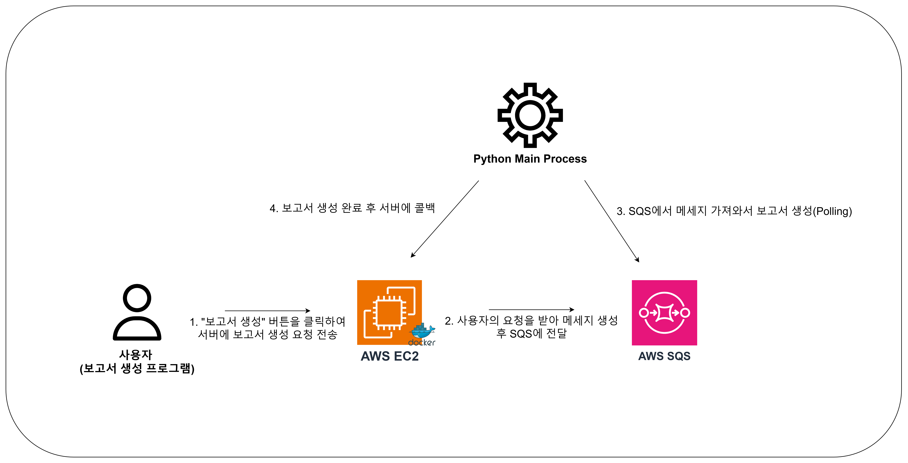
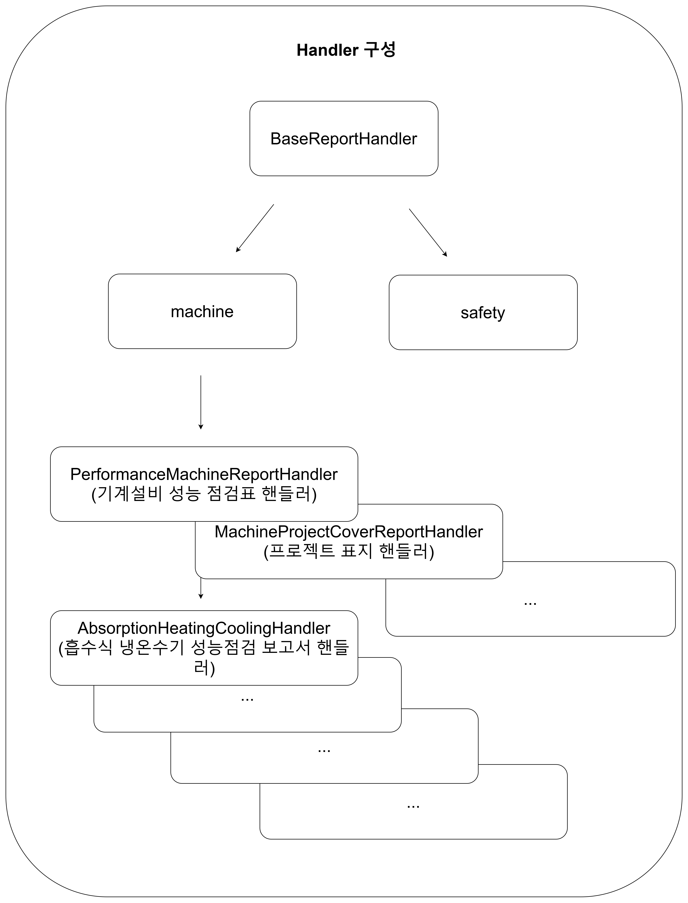
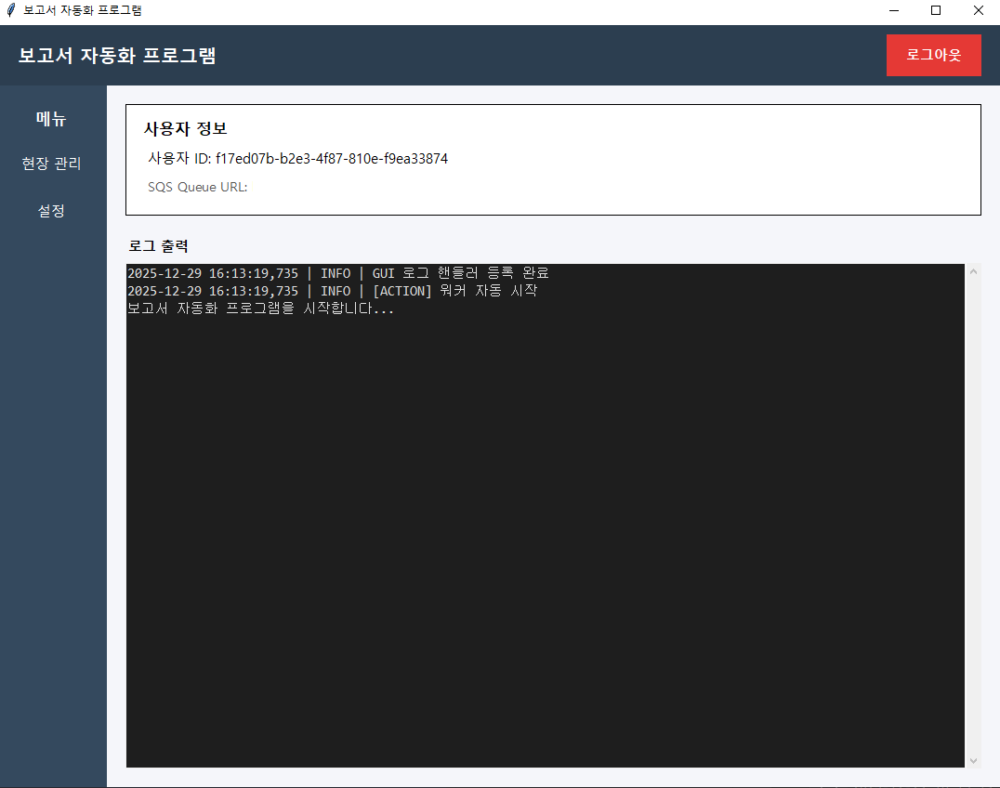
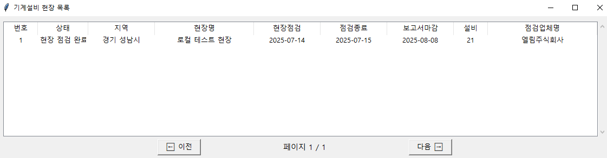
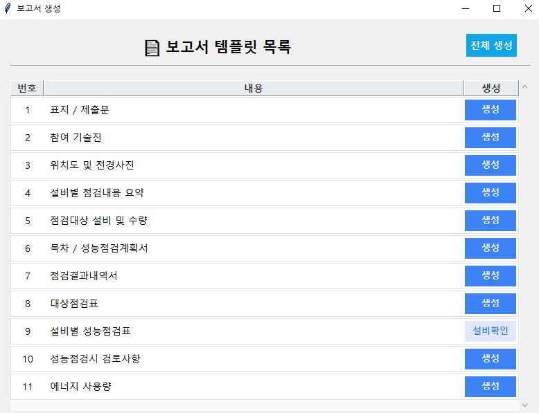
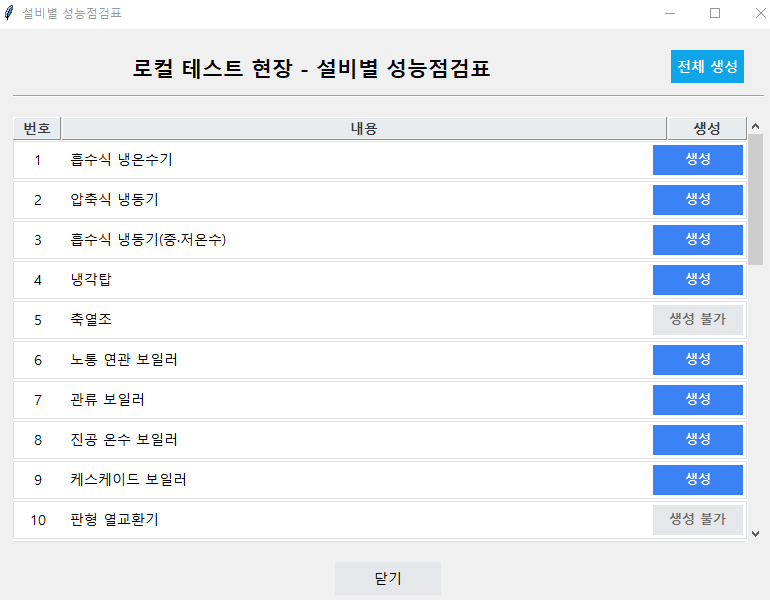
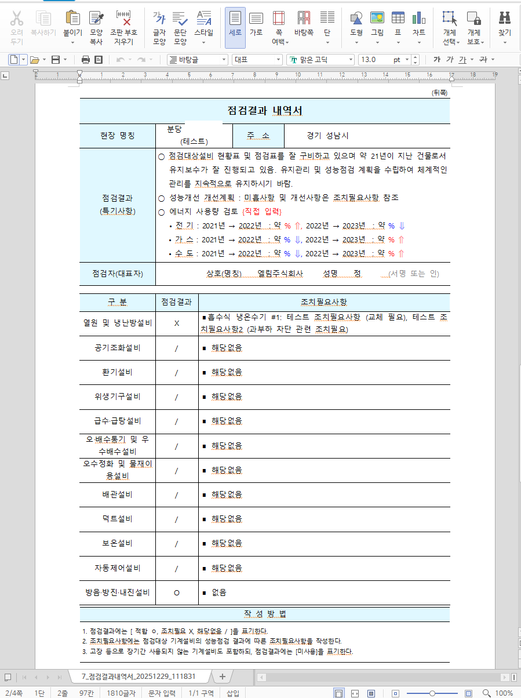
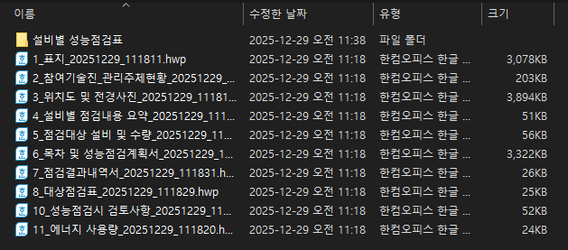
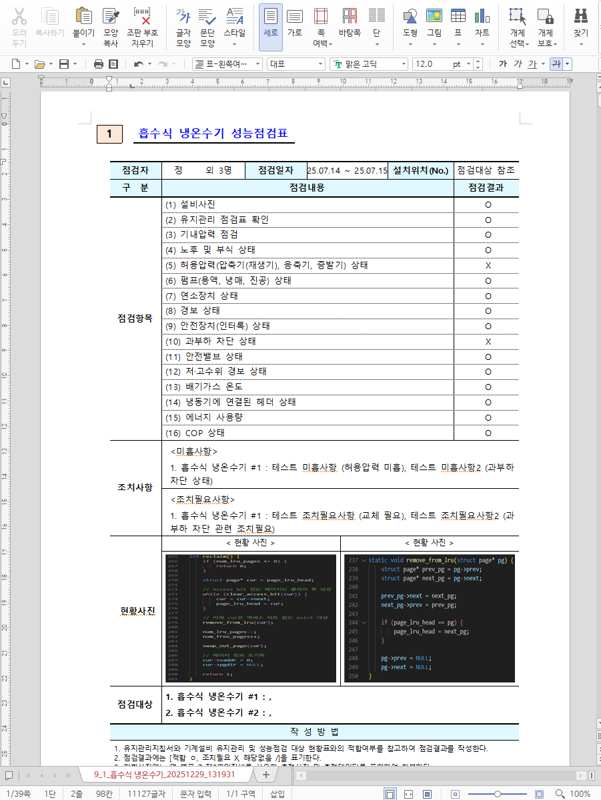

# 한글 보고서 자동화 프로그램

## 1. 프로젝트 개요
개발 기간: 2025-11 ~ 2025~12

이 프로그램은 엘림 워크스페이스에 저장된 **점검 결과 데이터를 기반으로**
대용량(100페이지 이상) 한글(HWP) 보고서를 자동 생성하기 위해 개발된 **보고서 자동화 프로그램**입니다. 

기존에는 점검 결과를 사람이 직접 취합하고 수작업으로 보고서를 전부 작성해야
했기 때문에 시간 소요가 크고, 생산성이 낮다는 문제가 있었습니다.

이를 해결하기 위해 이 프로그램은 API 서버로부터 전달받은 데이터를 기반으로
지정된 템플릿에 따라 보고서의 **약 80~90%를 자동으로 생성**하고 나머지
내용은 사람이 직접 보완하도록 설계되었습니다.

프레임워크를 사용하지 않은 순수 Python 코드로 작성되었으며, 
API 서버와 완전히 분리된 구조로 로컬에서 동작하여 
보고서 생성 작업이 서비스 전체 성능에 영향을 주기 않도록 구성하였습니다.

---

## 2. 설치 및 실행
### 2-1) 실행 환경
- Python 3.12.10 이상 권장
- Windows 환경

---

### 2-2) 사용 라이브러리
| 라이브러리     | 사용 목적              |
|-----------|--------------------|
| **boto3** | AWS SQS, S3 연동     |
| **requests** | 외부 API 통신          |
| **python-dotenv** | 환경 변수(.env) 관리     |
| **docxtpl** | Word(DOCX) 템플릿 렌더링 |
| **pywin32** | 한글(HWP) 자동화 제어     |
| **cachetools** | 반복 데이터 캐싱 및 성능 최적화 |
| **pyinstaller** | 실행 파일(.exe) 빌드용 (선택) |

---

### 2-3) 라이브러리 설치
> 보고서 자동 생성 프로그램 실행을 위해 아래 필수 라이브러리를 설치합니다.
```
pip install boto3 requests python-dotenv docxtpl pywin32 cachetools
```

---

#### 실행파일(.exe) 빌드용 라이브러리 설치

```
pip install pyinstaller
```

실행파일 빌드가 필요한 경우 pyinstaller를 추가로 설치해야 합니다.

---

### 2-4) 설치 확인
> 설치된 라이브러리 목록을 확인하여 필수 패키지가 정상적으로 설치되었는지
> 검증합니다.

```
pip list
```

---

### 2-5) 환경 변수 설정 (.env, .env.user)
> 실행 전, 프로젝트 루트에 `.env`, `.env.user` 파일을 생성하고 아래 항목들을
> 환경에 맞게 설정해야 합니다
> 
> 단, exe 파일로 빌드하여 실행하는 경우에는 별도의 환경 변수 설정이 필요하지 않습니다.

#### 📌 고정 환경 변수 (.env)
| 변수명                     | 설명                                 |
|-------------------------|------------------------------------|
| `STORAGE_TYPE`          | 보고서 결과물 저장소 타입 (`s3` 고정)           |
| `REPORT_TEMPLATE_PATH`  | 기본 보고서 템플릿 파일 경로 (프로젝트 루트 기준 상대경로) |
| `AWS_ACCESS_KEY`        | AWS 접근용 Access Key                 |
| `AWS_SECRET_ACCESS_KEY` | AWS 접근용 Secret Key                 |
| `AWS_SQS_QUEUE_URL`     | 보고서 생성 요청을 수신하는 SQS Queue URL      |
| `USER_ID`               | 사용자 ID (UUID)                      |

<br>

#### 📌 사용자 환경 변수 (.env.user)
| 변수명                 | 설명                                 |
| ------------------- |------------------------------------|
| `USER_ID`           | 보고서 생성 요청의 기준이 되는 사용자 ID           |
| `EMAIL`             | 로그인에 사용되는 사용자 이메일                  |
| `PASSWORD`          | 로그인에 사용되는 사용자 비밀번호 (해시 값)          |
| `ACCESS_TOKEN`      | API 호출 시 사용되는 Access Token         |
| `REFRESH_TOKEN`     | Access Token 재발급을 위한 Refresh Token |
| `AUTO_LOGIN`        | 자동 로그인 사용 여부 (`true` / `false`)    |
| `SERVER_BASE_URL`   | API 서버 기본 주소                       |
| `CALLBACK_BASE_URL` | 보고서 생성 완료/실패 시 호출될 콜백 API 주소       |
| `VISIBLE`           | 보고서 생성 UI 출력 여부                    |
| `DELAY`             | 보고서 렌더링 단계 간 딜레이 시간 (초 단위)         |
| `AWS_REGION`        | AWS 리전                             |
| `AWS_S3_BUCKET`     | 보고서 업로드 대상 S3 버킷                   |
| `AWS_SQS_QUEUE_URL` | 보고서 생성 요청 송신용 SQS Queue URL        |


---

### 2-6. 프로그램 실행
> 메인 워커 프로그램은 아래 명령으로 실행할 수 있습니다.
```
python main.py
```

exe 파일을 이미 빌드했다면 해당 exe 파일 더블클릭으로도 실행 가능합니다.

---

## 3. 아키텍처
> 보고서 자동생성 프로그램은  API 서버 - 메세지 큐(SQS) - Python 워커
> 프로세스로 분리된 구조로 동작합니다




### 3-1) 전체 동작 흐름 
> Local(Python worker process) -> API 서버 -> SQS -> Local
1. 보고서 생성 요청
   - 사용자가 보고서 생성 프로그램에서 `보고서 생성` 버튼을 클릭
   - API 서버(Spring boot)로 보고서 생성 요청에 전송

2. 메세지 생성 및 큐 적재
   - API 서버는 요청 및 **workspace에 저장된 데이터를 기반**으로 
   보고서 생성 메세지(JSON)를 생성
   - 생성된 메세지를 AWS SQS에 전송

3. 메세지 소비 및 보고서 생성
   - Python 워커 프로세스가 SQS를 폴링하여 메세지 수신 (IAM 사용자 기반으로 SQS 접근)
   - 메세지 내용을 기준으로 지정된 템플릿에 맞춰 보고서 생성

4. 생성 완료 후 결과 처리
   - 보고서 생성 완료 후 결과 상태를 서버에 콜백 요청 전송
   - 생성된 파일은 로컬, S3 버킷에 저장

---

### 3-2) 세부 흐름
<table>
   <tr>
      <td align="center">
         
         <br/>
         <b>세부 흐름</b>
      </td>
   </tr>
</table>

1. 워커 프로세스 실행
   - Pythom 워커 프로세스를 실행하면 main.py가 시작됩니다.
   - 메인 프로세슬는 내부적으로 sqs_consumer를 초기화합니다.

2. SQS 메세지 폴링
   - sqs_consumer는 AWS SQS에 접근하여 메세지를 Polling 방식으로 조회합니다.
   - 메세지가 없는 경우, Long Polling 방식으로 대기하며 무한 루프를 유지합니다

3. 메세지 수신 처리
   - 메세지가 수신되면 report_service.process_report()를 호출하여 
   실제 보고서 생성 로직을 실행합니다.

4. 보고서 타입 판별 및 핸들러 선택
   - report_service는 SQS 메세지를 인자로 전달받아 메세지에 포함된 reportTemplateCode를
   확인합니다.
   - 이후 ReportFactory.get)handler()를 호출하여 해당 코드에 매핑된
   보고서 생성 핸들러를 선택합니다
   - 참고로 설비별 성능 점검표는 하나의 핸들러를 쓰고, renderer만 바꿔서 사용함

<details>
<summary><b>👉 핸들러 구성 사진으로 보기</b></summary>
<table>
   <tr>
      <td align="center">
         
         <br/>
         <b>핸들러 구성</b>
      </td>
   </tr>
</table>
</details>

5. 핸들러 기반 템플릿 처리 준비
   - 선택된 핸들러는 다음 역할을 수행합니다.
     - parse_message() -> 메세지 파싱
     - build_context() -> 템플릿 랜더링에 사용할 DTO 생성
     - build_output_path() -> 생성될 보고서 파일 경로 설정(로컬)
     - get_template_path() -> 사용할 템플릿 파일 경로 조회
   - 즉, 이 단계에서 메세지 파싱 -> 템플릿용 데이터 구성 -> 파일/템플릿 경로 결정을 하는 단계임

6. 템플릿 랜더링 및 파일 생성
   - 준비된 DTO(context)와 템플릿을 기반으로 render() 함수를 호출합니다.
   - 보고서 파일을 로컬 임시 경로에 생성합니다.

7. 저장소 업로드
   - 생성된 보고서 파일을 지정된 저장소로 업로드 합니다. (S3)

8. 결과 콜백 처리
   - 보고서 생성이 완료 되면 API 서버에 성공 콜백을 전송합니다.
   - 처리 중 오류가 발생한 경우 실패 콜백을 전송합니다. 
   - API 서버는 콜백을 받아 보고서 엔티티의 상태를 
   Pending -> Completed / Failed로 갱신합니다.


---

## 4. 주요 기능
### 🔹 보고서 생성
> 서버에 있는 프로젝트(현장) 목록을 조회하여 
> 점검 결과를 기반으로 보고서를 자동 생성합니다. 

<table align="center">
  <tr>
    <td align="center">
      
      <br/>
      <b>메인 화면</b>
    </td>
    <td align="center">
      
      <br/>
      <b>프로젝트(현장) 목록 조회</b>
    </td>
  </tr>
</table>

<table align="center">
  <tr>
    <td align="center">
      
      <br/>
      <b>일반 보고서 생성</b>
    </td>
    <td align="center">
      
      <br/>
      <b>설비별 성능점검표 생성</b>
    </td>
  </tr>
</table>

<br>
<details>
  <summary><b>👉 생성 단계별 화면 더보기</b></summary>

<table align="center">
  <tr>
    <td align="center">
      
      <br/>
      <b>일반 보고서 생성 화면</b>
    </td>
  </tr>
</table>

<table align="center">
  <tr>
    <td align="center">
      
      <br/>
      <b>설비별 성능점검표 생성</b>
    </td>
  </tr>
</table>

<table align="center">
  <tr>
    <td align="center">
      
      <br/>
      <b>실제 랜더링 화면</b>
    </td>
  </tr>
</table>

> ⚠️ **참고**
>
> 위 GIF에 표시되는 화면 중 `실제 랜더링 화면`은
> **보고서 생성 과정을 시각적으로 확인하기 위한 옵션 UI**이며,  
> **테스트용 데이터 및 테스트 이미지**를 기반으로 구성되어 있습니다.
>
> 실제 사용 환경에서는 해당 화면이 노출되지 않으며,  
> **백엔드에서 보고서 생성이 백그라운드 작업으로 자동 수행**됩니다.  
> (UI 출력 여부는 설정을 통해 활성화/비활성화 가능)

</details>

---

### 생성 완료된 보고서 예시
#### 일반 보고서

> 아래 이미지는 자동 생성된 보고서(HWP, 100+ 페이지) 중 **구조와 내용 이해를 위한 일부 페이지 발췌본**입니다.
>
> 보안 및 설명 목적에 따라 일부 이미지와 내용은 **의도적으로 편집·제거**되어 있으며,  
> 포함된 대부분의 사진 및 데이터는 **테스트용 샘플 데이터**를 기반으로 구성되어 있습니다.


<table>
  <tr>
    <td align="center">
      
      <br/>
      <b>표지</b>
    </td>
    <td align="center">
      
      <br/>
      <b>참여기술진 및 관리주체현황</b>
    </td>
  </tr>
</table>

<table>
  <tr>
    <td align="center">
      
      <br/>
      <b>점검대상 설비 및 수량</b>
    </td>
    <td align="center">
      
      <br/>
      <b>점검결과 내역서</b>
    </td>
  </tr>
</table>

<table>
  <tr>
    <td align="center">
      
      <br/>
      <b>성능점검시 검토사항</b>
    </td>
    <td align="center">
      
      <br/>
      <b>일반 보고서 파일</b>
    </td>
  </tr>
</table>
<br>

#### 설비별 성능점검표

> 아래 이미지는 자동 생성된 보고서(HWP, 100+ 페이지) 중 **구조와 내용 이해를 위한 일부 페이지 발췌본**입니다.
>
> 보안 및 설명 목적에 따라 일부 이미지와 내용은 **의도적으로 편집·제거**되어 있으며,  
> 포함된 대부분의 사진 및 데이터는 **테스트용 샘플 데이터**를 기반으로 구성되어 있습니다.


<table>
  <tr>
    <td align="center">
      
      <br/>
      <b>설비별 성능점검표 예시1</b>
    </td>
    <td align="center">
      
      <br/>
      <b>설비별 성능점검표 예시2</b>
    </td>
  </tr>
</table>

<table>
  <tr>
    <td align="center">
      
      <br/>
      <b>설비별 성능점검표 예시3</b>
    </td>
    <td align="center">
      
      <br/>
      <b>설비별 성능점검표 예시4</b>
    </td>
  </tr>
</table>

<table>
  <tr>
    <td align="center">
      
      <br/>
      <b>설비별 성능점검표 파일</b>
    </td>
  </tr>
</table>

---

